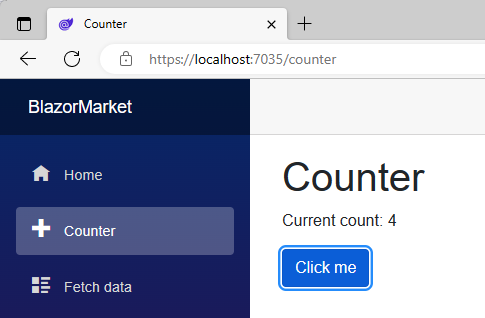
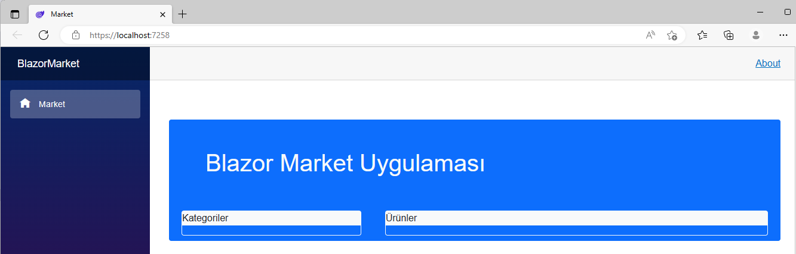
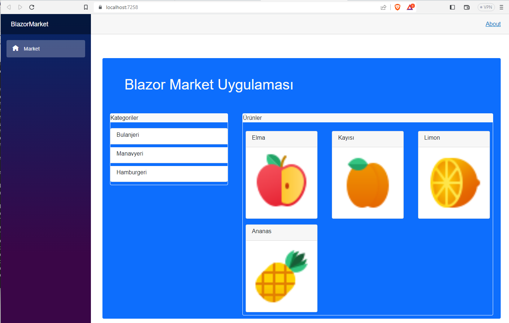

# BlazorMarket

Bu denememde boş olmayan "Blazor Server App" proje kalıbını kullandım.
Bu seçim projeye ileride veritabanı bağlantılarında kullanabileceğim
bir altyapı eklemiş oldu. Ya da ben öyle sanıyorum.
Çok da önemli de değil; henüz bir veritabanıyla muhatap olacak
bir uygulama geliştirmeye çalışmıyorum.
Daha hala arayüz tasarımı konusunda ilerlemeye çalışıyorum.

Her neyse, bu projede pencerelerin görünüm düzenlerini
(*layout*) ne mavigasyon menülerini içeren bir **Shared** klasörü
ve bir de veri alışverişi sağlayacak servis tanımlarının
konacağı bir **Data** klasörü var.

Uygulamanın şimdiki ilk halinde bile bir şeyler yapan
içeriği var; ana sayfa bazı linklerle açılıyor.
Soldaki menüden "Counter" (Sayaç) seçeneğini tıklayınca,
çıkan sayfada tıklandıkça bir sayaç değerini arttıran bir düğme var:



Sol menüdeki "Fetch Data" seçeneği de gaipten
hayali hava durumu verileri alıp getiren bir sayfa açıyor.

## Hazır Gelen İçeriğin Silinmesi

Bu uygulamada ana sayfadaki ankete, sayaç arttıran düğmeye
ve hayali hava durumu verilerini almaya gerek duymayacağım.
O nedenle, projenin **Sayfalar** klasöründen
"Counter.razor" ve "FetchData.razor" dosyalarını,
**Data** klasöründen de WeatherForecast... diye başlayan
dosyaları sildim.

Hemen de bilinçsiz iş yapmamın cezasını gördüm.
Visual Studio artık geçersiz kalan bir referans hakkında
hata mesajı veriyordu:

```
The type or namespace name 'Data' does not exist in the namespace 'BlazorMarket' (are you missing an assembly reference?)
```

Bunun nedeni Data klasörü içeriğini tümden silmiş olmamdı.
O klasör normalde projeye eklenecek veri sağlama servisleri
için gerekebilir, yani referansı olmalıdır,
ama bu uygulamaya şu an için öyle bir yetenek eklemeyeceğim.

Bu nedenle hatanın kaynağı olan Program.cs dosyasının
başındaki `using BlazorMarket.Data;` referansını
geçici olarak açıklama satırına dönüştürdüm.
Hava durumu servisi ekleyen
```
builder.Services.AddSingleton<WeatherForecastService>();
```

komutunu da aynı şekilde gizledim.

"NavMenu.razor" dosyasına gidip, menü seçeneklerini de
sildim; yalnızca ana sayfaya erişen seçenek kaldı,
onun da içeriğini değiştirdim:

```
<div class="@NavMenuCssClass nav-scrollable" @onclick="ToggleNavMenu">
    <nav class="flex-column">
        <div class="nav-item px-3">
            <NavLink class="nav-link" href="" Match="NavLinkMatch.All">
                <span class="oi oi-home" aria-hidden="true"></span> Market
            </NavLink>
        </div>
    </nav>
</div>
```

Ana sayfa Index.razor başlığını da bir önceki boş uygulama
projemdeki gibi yaptım:

```
@page "/"

<PageTitle>Market</PageTitle>

<div class="container mt-5 bg-primary rounded border border-dark">
    <h1 class="m-5 display1 text-light">Blazor Market Uygulaması</h1>

</div>
```

İlginçtir, ana sayfa tıpkı önceki uygulamadaki gibi gözüküyordu.
Yani, en azından Bootstrap sınıf tanımları zaten vardı.
Proje organizasyonuna bakarsanız, gerçekten de,
**wwwroot/css** klasöründe **bootstrap.min.css**
referansını bulacaksınız.

Hatta, uygulama sayfalarında ortak kullanılacak
stil tanımlarını içeren **site.css** dosyasında da
önceki boş uygulamada kurtulmaya çalıştığım
esrarengiz kenarlığı iptal eden şu tanım vardı:
```
h1:focus {
    outline: none;
}
```

## Ana Sayfanın Planlanması

Bu uygulamada ürün kategorileri olacak ve
kategorilere ait ürünler olacak.
Bunları bir veritabanından almayacağım,
onu yerine, kodlarla kendi tanımladığım
nesnelerde oluşan listeleri görüntüleyeceğim.

Kısacası, aşağıdaki gibi bir yerleşim düzeni
oluşturmayı planladım:



Bu düzen kullanışlı olacak mı, şu an o konuya girmiyorum.
Başlangıç olarak bu taslakla işe başlıyorum:
```
@page "/"

<PageTitle>Market</PageTitle>

<div class="container mt-5 bg-primary rounded border border-primary h-75 d-inline-block">
    <h1 class="m-5 display1 text-light">Blazor Market Uygulaması</h1>

    <div class="row">
        <div class="col-md-4">
            <div class="border border-light m-2 rounded rounded-5">
                <p class="bg-light">Kategoriler</p>
            </div>
        </div>

        <div class="col-md-8">
            <div class="border border-light m-2 rounded rounded-5">
                <p class="bg-light">Ürünler</p>
            </div>
        </div>
    </div>
</div>
```
Bu sayfadaki etiketlerde belirtildiği gibi,
sol sütunda kategoriler listelenecek,
sol sütunda seçilmiş kategoriye ait ürünler de
sağ dütunda listelenecektyir.

## Model Sınıfları

Bir ürünü temsil edecek olan sınıf tanımım
aşağıdaki gibi:
```
    public class Urun
    {
        public int Id { get; set; }
        public string Name { get; set; }
        public string? ImagePath { get; set; }

        public Urun()
        {
            Name = string.Empty;
        }
    }
```
Bir ürün kategorisini temsil edecek olan sınıf tanımı da şöyle:
```
    public class Kategori
    {
        public int Id { get; set; }
        public string Name { get; set; }
        public List<Urun> Urunler { get; set; }

        public Kategori()
        {
            Name = string.Empty;
            Urunler = new List<Urun>();
        }
    }
```

> *Aslında, ileride Entity Framework aracılığıyla sınıf tanımlarını
veri tablolarına dönüştürmeyi düşündüğüme göre,*
kategoriye ait ürünler listesini<br>
`virtual ICollection<Urun>` <br>
*şeklinde tanımlamalıydım.<br>
O zaman bir kategoriyle bağlantılı ürün kayıtları
bağlantılı tablodan toparlanıp ait oldukları
kategori kaydınının altında bir sanal koleksiyon oluştururlardı.
Şimdilik öyle bir derdim yok;
öyle bir derdi olan kendisi düzeltsin eksikleri.*


## Resimlerin Eklenmesi

Bu uygulamada listeleyeceğim hayali ürünler için
temsili resimler aramıştım.
https://icon8.com sitesinde bulup hazır kullandığım
resimlerin linklerini aşağıda sıralıyorum:

+ <a target="_blank" href="https://icons8.com/icon/iNCwBXAbgKmw/baguette">Baguette</a> icon by <a target="_blank" href="https://icons8.com">Icons8</a>
+ <a target="_blank" href="https://icons8.com/icon/kuKTcGYLm4j8/biscuits">Biscuits</a> icon by <a target="_blank" href="https://icons8.com">Icons8</a>
+ <a target="_blank" href="https://icons8.com/icon/16RjD9RQVCUf/bread">Bread</a> icon by <a target="_blank" href="https://icons8.com">Icons8</a>
+ <a target="_blank" href="https://icons8.com/icon/FbwaGJPAh2Yz/brezel">Brezel</a> icon by <a target="_blank" href="https://icons8.com">Icons8</a>
+ <a target="_blank" href="https://icons8.com/icon/erEevcUCwAMR/hamburger">Hamburger</a> icon by <a target="_blank" href="https://icons8.com">Icons8</a>
+ <a target="_blank" href="https://icons8.com/icon/5vw2Fl2rpxRL/hot-dog">Hot Dog</a> icon by <a target="_blank" href="https://icons8.com">Icons8</a>
+ <a target="_blank" href="https://icons8.com/icon/Q2fre4pbJjTx/pizza">Pizza</a> icon by <a target="_blank" href="https://icons8.com">Icons8</a>
+ <a target="_blank" href="https://icons8.com/icon/RNqrG3huUiNN/taco">Taco</a> icon by <a target="_blank" href="https://icons8.com">Icons8</a>
+ <a target="_blank" href="https://icons8.com/icon/nc75M1luTW1N/sandwich">Sandwich</a> icon by <a target="_blank" href="https://icons8.com">Icons8</a>
+ <a target="_blank" href="https://icons8.com/icon/s3EqD09UVwX5/apple">Apple</a> icon by <a target="_blank" href="https://icons8.com">Icons8</a>
+ <a target="_blank" href="https://icons8.com/icon/zWL7WzI3sC0T/apricot">Apricot</a> icon by <a target="_blank" href="https://icons8.com">Icons8</a>
+ <a target="_blank" href="https://icons8.com/icon/LjAILXrCRYc6/banana">Banana</a> icon by <a target="_blank" href="https://icons8.com">Icons8</a>
+ <a target="_blank" href="https://icons8.com/icon/pSpJ8f1TAKIZ/citrus">Citrus</a> icon by <a target="_blank" href="https://icons8.com">Icons8</a>
+ <a target="_blank" href="https://icons8.com/icon/yoflzK7JQMwS/pineapple">Pineapple</a> icon by <a target="_blank" href="https://icons8.com">Icons8</a>

Bu resimler projenin **Images** klasöründedir.
> *Aslında veritabanı bağlantılı projelerde model sınıfları
   **Data** klasöründe olurlar.*

## Kategori ve Ürün Listelerinin Oluşturulması
Bu uygulamada henüz veritabanı bağlantısı yok,
ama sanki varmış da uygulama ilk açılışında
kategori ve ürün listelerini veritabanından
alıp geliyormuş gibi olsun diyoruz.

Dolayısıyla,
```
private void MarketAc()
```
adlı fonksiyonda kategori tanımları oluşturduk
ve onlara bazı ürün tanımları ekledik:
```
Kategori pastaneReyonu = new Kategori("Bulanjeri");

pastaneReyonu.Urunler.Add(new Urun("Ekmek", "icons8-bread-48.png"));
pastaneReyonu.Urunler.Add(new Urun("Baget", "icons8-baguette-48.png"));
pastaneReyonu.Urunler.Add(new Urun("Bisküvi", "icons8-biscuits-48.png"));
pastaneReyonu.Urunler.Add(new Urun("Bredzel", "icons8-brezel-48.png"));
```

Bu fonksiyonu uygulamanın ana sayfası **Index.razor** 
kod dosyasındaki **@code{ }** blokunda bulacaksınız.

Ama bu fonksiyonu uygulamanın ilk açılışında çalıştırmamız
gerekir ki oluşturduğumuz market reyonları ana sayfada listelensinler.

Bir Blazor server uygulamasının açılışında yaptırılacak işleri<br>
`OnInitializedAsync()`<br>
adlı fonksiyonda yaptırmalıyız.

Bu fonksiyon normalde uygulamanın gerektyirdiği standart
başlangıç işlemlerini gerçekleştirir.
Biz kendi uygulamamızda onunla farklı işlemler yaptırmak
istiyorsak, onu **override** etiketiyle yeniden tanımlamalıyız:
```
    protected override async Task OnInitializedAsync()
    {
        await MarketAcmaGorevi();
    }

    private Task MarketAcmaGorevi()
    {
        MarketAc();
        return Task.CompletedTask;
    }
```

Yeniden tanımladığımız başlangıç fonksiyonunda
"görev" (**Task**) gerçekleştirecek ilk fonksiyonları
çağırabiliriz. Bu uygulama örneğinde **MarketAcmaGorevi()**
diye kendi görev fonksiyonumuzu çağırttık.

> *Bu uygulamanın açılış fonksiyonu
   market açan görev fonksiyonu çağırıyor,
   ama iş akışını ona devretmiyor,
   ondan sonuç bekliyor (**await**).<br>
   Web uygulamaları sıradan masaüstü uygulamalardaki
   gibi tek bir iş akışıyla yürümeyen,
   "asenkronize" uygulamalardır.*

Uygulama ilk açıldığında sanal marketin 
tanımlanmış ürünleri sergileniyor olacaktır:

