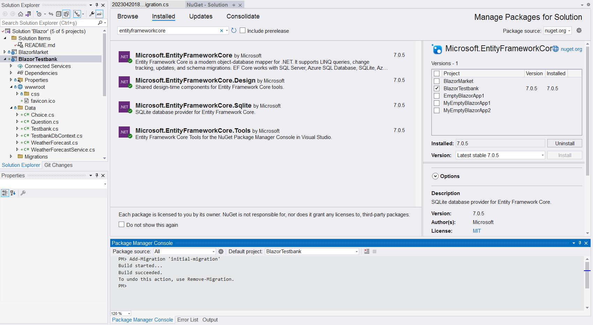
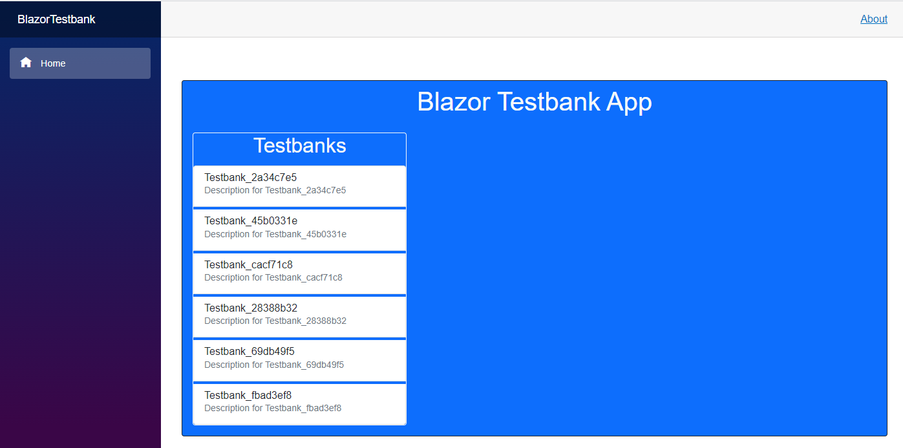

# BlazorTestbank

Bu projeyle çoktan seçmeli sorular içeren 
soru bankalarını listeleyecek,
ekleme/okuma/düzenleme/dilme (*CRUD*)
işlemleri yapabilecek, veritabanı bağlantılı
bir Blazor sunucu uygulaması oluşturuyorum.

Daha önce başladığım 
[**AngularTest**](https://github.com/freebelion/AngularTest)
web uygulamasının Blazor versiyonunu
oluşturmayı hedefliyorum.

Tıpkı **AngularTest** uygulamasındaki gibi,
önce soru bankalarını, soruları ve seçenekleri
temsil edecek sınıf tanımları oluşturacağım.
Daha sonra bu *Entity Framework* (***Code First***)
yaklaşımını izleyerek, bu sınıf tanımlarına
dayalı tablolar içeren veritabanı oluşturacağım.
O aşamalarda 
[bu linkteki](https://www.c-sharpcorner.com/article/blazor-crud-app-using-entity-framework-core-in-net-5/)
gibi örneklerdeki adımları taklit edeceğim.

***Önemli Not***<br>
Aslında veritabanı bağlantılı
masaüstü veya web uygulamaları geliştirirken,
EntityFramework modülleriyle
var olan bir veritabanının tablolarına
dayalı sınıf tanımları oluşturulması
(**Database First**) yaklaşımı daha yaygındır.
Çünkü bu türden uygulamaların olası müşterileri
zaten epeydir veritabanlarında
bilgiler saklıyordur.
   
O yaklaşımı da denemeyi umuyorum.
Bu seferlik, kodlarını sıfırdan yazacağım
bu uygulama için **Code First** yaklaşımını
tercih ettim.
Bu yaklaşımla geliştirilen bir uygulama
uygulama kurulmadan önce hazır olması gereken
bir veritabanının da kurulum paketi
içinde taşınmasını,
ya da kullanıcının bilgisayarında
önceden veritabanı oluşturulmasını gerektirmez.

## Projenin Oluşturulması
Blazor Server App kalıbına dayalı
bir proje oluşturdum.
Tabi bu nedenle proje bazı hazır içeriklerle geldi.
Onları ileriki adımlarda sileceğim.

### "Data" Klasörüne Sınıf Tanımları Eklenmesi
Bu proje kalıbıyla hazır gelen "**Data**" proje
klasörü veritabanı bağlantılarında aracı olacak
sınıf tanımları içindir.
Veritabanı kayıtlarına esas olacak sınıf
tanımlarını da bu klasöre ekliyorum.

+ **`Testbank` Sınıf Tanımı**<br>
  Bir soru bankasını temsil edecek sınıf tanımında
  - soru bankasına verilen adı saklayacak
  **Name** özelliği ile
  - onu tarif edecek bir açıklamayı saklayacak
  **Description** özelliği var:
  ```
    public class Testbank
    {
        [Key]
        [DatabaseGenerated(DatabaseGeneratedOption.Identity)]
        public int Id { get; set; }
        public string Name { get; set; }
        public string Description { get; set; }

        public virtual ICollection<Question> Questions { get; set; }

        public Testbank()
        {
            Guid gid = Guid.NewGuid();
            Name = "Testbank_" + gid.ToString().Substring(0, 8);
            Description = "Description for " + Name;
            Questions = new List<Question>();
        }
    }
    ```
  - `Id` özelliği bu sınıfa dayalı veri tablosu
     kayıtları için ayırt edici sıra numarasını
     saklayacak. Bu sıra nosu veri kaydı eklenirken
     belirlenecek olan "anahtar" (**Key**) bilgidir.
     Biz onu belirleyecek bir işlem yapmıyoruz.
  - `Questions` özelliği de soru bankasındaki
    sorular listesinin referansını taşıyacak.
    Soruları temsil edecek sınıfı da
    aşağıda tanımlıyoruz.

+ **`Question` Sınıf Tanımı**<br>
  
  ```
    public class Question
    {
        [Key]
        [DatabaseGenerated(DatabaseGeneratedOption.Identity)]
        public int Id { get; set; }

        public string HtmlContent { get; set; }

        public virtual ICollection<Choice> Choices { get; set; }

        public Question()
        {
            HtmlContent = "<b>Question_" + Id.ToString() + "</b> Html Content";
            Choices = new List<Choice>();
        }
    }
  ```
  - Bir soruyu temsil edecek olan `Question`
    sınıfında otomatik oluşturulacak
    anahtar bilgi `Id` yanında,
  - sorunun HTML içeriğini saklayacak olan
    `HtmlContent` özelliği,
  - çoktan seçmeli sorular için seçenekler listesine
    referans yapan `Choices` özelliği var.

+ **`Choice` Sınıf Tanımı**<br>
  ```
  public class Choice
    {
        [Key]
        [DatabaseGenerated(DatabaseGeneratedOption.Identity)]
        public int Id { get; set; }

        public string HtmlContent { get; set; }

        public Choice()
        {
            HtmlContent = "<i>Choice</i>";
            HtmlContent = string.Empty;
        }
    }
  ```
  - Çoktan seçmeli bir sorunun  bir seçeneğini
    temsil edecek olan `Choice`
    sınıfında otomatik oluşturulacak
    anahtar bilgi `Id` yanında,
  - seçeneğin HTML içeriğini saklayacak olan
    `HtmlContent` özelliği var.

Bu sınıf tanımları *Entity Framework* tarafından
veri tablolarını oluşturmak için kullanılacaktır.
Örneğin, `Testbank` sınıf tanımına dayalı
olarak bir `Testbanks` tablosu oluşturulacak,
sınıf özelliklerinin her biri de
o veri tablosunun bir sütunu (*data field*)
olarak gözükecektir.

### EntityFramework Modüllerinin Eklenmesi
Visual Studio geliştirme ortamının
**Tools** menüsünü açarsanız, o menüde
"Nuget Package Manager" seçeneğini göreceksiniz.
> Türkçesini bilmiyoruz, ama herhalde
  "Nuget paket Yöneticisi" gibi bir şeydir.

O seçeneğin alt menüsündeki ikinci seçeneği,
yani "Manage Nuget packages for Solution"
seçenğini tıklarsanız, NuGet ile proje grubuna
hazır modüller ekleyebilirsiniz.

Bizim eklediğimiz modülleri
aşağıdaki resimde gösterdik:


Özetle,
+ Projeyi .NET Core ile geliştirdiğimiz için
  **Microsoft.EntityFrameworkCore** modülünü seçtik.
+ Bu modülün sağladığı hazır tanımları kullanabilmek için de
  **Microsoft.EntityFrameworkCore.Design**
  ve **Microsoft.EntityFrameworkCore.Tools**
  modüllerini ekledik.<br>
  Bu iki modülün kesin gerekli olup olmadığından
  çok da emin değiliz. Biz örnekleri taklit ediyorduk.
  Eğer siz onları eklemeden de projenizi
  çalıştırmışsanız, onlara gerek yokmuş demektir.
+ SQLServer gibi kapsamlı bir kurulum gerektirmeyen
  "yerel" bir veritabanı kullanalım diye,
  **Microsoft.EntityFrameworkCore.SqLite**
  modülünü ekledik.

### Veritabanı Dönüşümü
Yukarıdaki ekran resminde *EntityFramework* ile
veritabanının oluşturulması adımını da gösterdik:

"Nuget Package Manager" seçeneğinin alt menüsündeki
ilk seçeneği (*Package Manager Console*) tıklayıp,
NuGet modüllerini komutlarla ayarlamamıza
izin veren konsol penceresini açtık.

Sınıf tanımlarına dayalı olarak veritabanını
oluşturmak için<br>
`Add Migration 'Initial Migration'`<br>
komutunu çalıştırdık.

***DİKKAT!***<br>
`Add Migration` komutu sınıf tanımlarından
veritabanına bir "göç" işlemi başlatarak
veritabanını oluşturur.
Bu komutu izleyen tırnaklar içindeki ifade
bu "göç" adımına bizim verdiğimiz addır.
Bu ad "Kalktı göç eyledi tabansız veriler."
de olabilirdi.
Önemli olan şey, her göç adımına ayrı bir ad vermektir.
Biz bu projeyi geliştirirken sınıf tanımlarında 
başka değişiklikler yapsaydık,
tablo yapıları da onlarla uyumlu olacak
şekilde değişsin diye yi `Add Migration` komutunu
başka bir ad vererek yenileyecektik.

### Veritabanı Aracı Nesnesinin Oluşturulması
Veritabanı bir kod nesnesi değildir;
uygulamanın veritabanıyla iletişim kurması
için özel bir sınıf tanımlamamız gerekecektir.

Bu işi yapacak olan hazır bir sınıf tanımı
`DbContext` yukarıda eklediğimiz modüllerden
biriyle gelir (ama hangisi, bilmiyoruz).

O sınıf türü bir nesne oluştururken
ve o nesneyi kullanırken yapmamız gereken
ek ayarlar olacağı için, biz o sınıftan
kendi projemiz için ayrı bir sınıf
türetmeyi seçtik:

```
    public class TestbankDbContext : DbContext
    {
        public TestbankDbContext() : base()
        {
            Database.EnsureCreated();
        }

        public TestbankDbContext(DbContextOptions<TestbankDbContext> options) : base(options)
        {
            Database.EnsureCreated();
        }

        public DbSet<Testbank> Testbanks { get; set; }
        public DbSet<Question> Questions { get; set; }
        public DbSet<Choice> Choices { get; set; }

        protected override void OnConfiguring(DbContextOptionsBuilder optionsBuilder)
        {

            optionsBuilder.UseSqlite(@"DataSource=testbanks.db;");
        }
    }
```

Sınıf tanımındaki ilk iki fonksiyon
bu türden bir nesne oluşturulduğunda
gerekli ilk işlemleri gerçekleştirecek olan
"kurulum fonksiyon"larıdır.
Bunların tanım başlıkları aynı burada gösterdiğimiz
gibi olmalıdır. Sorgulamadan taklit edin, yeter,
biz de öyle yaptık.
Ama uygulamanızı önceden veritabanı yokken
denerseniz sorun çıkmasın diye
(*bizim denememizde sorun çıktı*)
veritabanının oluşturulduğundan emin olacak
komutları bu kurucu fonksiyonlara eklemeyi unutmayın.

Türettiğimiz bu sınıf 
atası olan `DbContext` sınıfına ait
`OnConfiguring()` metodunu 
`override` etketiyle yeniden tanımlıyor.
O fonksiyon uygulamamızın veritabanını
oluştururken kullanacağı SQLite
yerel veritabanının adını iletiyor.

Bu türetilmiş sınıf tanımın özellikleri de
sınıf tanımlarına dayalı veri tablolarına
referans yapmak içindir.

Uygulama aktifken bu türden bir nesne aracılığıyla
veritabanıyla iletişim kuracaktır.
Bu aracı nesnenin tanımını uygulamayı başlatan
işlemlerin yapıldığı Program.cs kod dosyasında
oluşturuyoruz:<br>
`builder.Services.AddDbContext<TestbankDbContext>();`<br>
Uygulama başlatılırken bu komut çalıştırılınca
`TestbankDbContext` sınıfı kendi konfigürasyonunu
oluşturacak, yani veritabanını açacak ve onunla
iletişim halinde kalacaktır.

### Veritabanı Bağlantı Hizmetinin Oluşturulması
Veritabanı aracı nesnesinin tablolara kayıt ekleyecek,
tablolardan kayıt bulup getirecek, 
tablolardaki kayıtları düzenleyecek
veya silecek olan üye fonksiyonları (metodları) vardır.
Web uygulamamızda gerekli yerlerde veritabanı
üzerinde işlem yaptırmak için o metodları kullanabiliriz,
ama metodları kullanım tarzımız değişirse,
ya da daha da kötüsü, SQLite yerine başka türden
veritabanı kullanmaya karar verirsek,
tüm o metod çağrılarını değiştirmemiz gerekebilir.

Bunu göz öüne alarak, veritabanı aracı nesnesini kullanacak
bir hizmet oluşturmak daha iyidir diye karar verdik.
Zaten baktığımız örneklerde de hep öyle yapılıyordu;
bir hikmeti vardı, herhalde.

Yine baktığımız örnekleri taklit ederek,
şu veritabanı iletişim hizmetini oluşturduk:

```
    public class TestbankDbService
    {
        private readonly TestbankDbContext tbdbContext;

        public TestbankDbService(TestbankDbContext tbContext)
        {
            tbdbContext = tbContext;
        }

        // Get a list of Testbanks
        public async Task<List<Testbank>> GetAllTestbanksAsync()
        {
            return await tbdbContext.Testbanks.ToListAsync();
        }
    }
```

Bu hizmet sınıfı aslında uygulamamız başlarken oluşturulan
`TestbankDbContext` türü veritabanı aracı nesnesi için
bir kılıf olarak iş görüyor.
Kurucu fonksiyonunda o aracı nesnenin bir referansını
alıp saklıyor. O referans aracılığıyla da veritabanı
üzerinde işlemler yaptıracaktır.

Örnek olarak **Testbanks** tablosundaki kayıtları alıp
listeleyecek olan bir metod ekledik.
Bu türden veritabanı işlemleri uzun sürebileceği için
asenkronize (eş zamanlı olmayan) bir çağrı kullandık.
Böylece web uygulamamız kendi işini görürken
soru bankalarının listelenmesi işini bu fonksiyona
havale edecek, ondan bir sonuç gelince 
oluşturulmuş listeyi görüntüleyecek.

Uygulama açılırken bu hizmetin de açılması için
yine Program.cs kod dosyasında bir ekleme yapmamız
gerekecektir:<br>
`builder.Services.AddScoped<TestbankDbService>();`

### Uygulama Ana Sayfasının Oluşturulması
Projemizin **Index.razor** kod dosyasındaki
düzenlemelerimizle web uygulamamızın
ana sayfasını oluşturacağız.

Orijinal projedeki örnek içeriği silip,
onun yerine aşağıdaki kodları ekledik:

```
@using BlazorTestbank.Data
@inject TestbankDbService tbdbService

@page "/"

<PageTitle>Testbanks</PageTitle>

<div class="container mt-5 bg-primary rounded border border-dark">
    <h1 class="m-2 display1 text-light text-center">
        Blazor Testbank App
    </h1>

    <div class="row">
        <div class="col-md-4 p-2">
            <!-- Soru bankaları Listesi burada gözükecek.-->
        </div>
    </div>
</div>

@code {
    List<Testbank>? TbList;
    protected override async Task OnInitializedAsync()
    {
        TbList = await Task.Run(() => tbdbService.GetAllTestbanksAsync());
    }
}
```

Bu ana sayfa veritabanıyla iletişim için bir **@inject**
çağrısıyla yukarıda tanıttığımız hizmeti başlatıyor.
Sayfanın **@code** blokuna bakarsanız,
sayfa açılırken işleme konacak olan
**OnInitializedAsync()** fonksiyonunda bu hizmetten
soru bankaları listesinin alındığı göreceksiniz.
> *Bu uygulama .NET Core tabanına dayalı olduğu için,
   listenin oluşturulmadığı bir duruma hazırlık olarak
   **TbList** için null (boş) adres alabilir bir
   referans değişkeni tanımı yaptık.*

Yani bu web uygulaması açılırken,
ilk işi veritabanında var olan soru bankaları
listesini alıp getirmektir.

O liste ana sayfadaki "container" türü çerçeve bölümünün
sol bölümünde görüntülenecektir.
Ama liste görüntüleme işini bu ana sayfada değil,
ayrı bir Blazor öğesinde yaptırmayı planlıyoruz.

### Soru Bankası Listeleyen Öğenin Oluşturulması
Düz kod yazarken işleri ayrı fonksiyonlarda
yaptırdığımız gibi, we uygulamalarında da
ayrı işleri ayrı öğelere (*components*)
yaptırmayı tercih etmeliyiz.
Biz de soru bankalarını listeleme işini
ana sayfadan ayrı bir Razor öğesinde yaptıracağız.

Uygulamanın sayfa tanımlarının bulunduğu
**Pages** proje klasörü üzerinde
"Add" > "Razor Component" menü seçeneklerini
tıklayarak, **TestbankListComponent.razor**
adlı şu öğeyi oluşturduk:

```
@using BlazorTestbank.Data

@if (tbanks != null)
{
    <div class="border border-light m-2 rounded rounded-5">
        <h2 class="display2 text-light text-center">Testbanks</h2>
        <ul class="list-group">
            @foreach (var tb in tbanks)
            {
                <li class="list-group-item mt-1">
                    <h6>
                        @tb.Name<br>
                        <small class="text-muted">
                            @tb.Description
                        </small>
                    </h6>
                </li>
            }
        </ul>
    </div>
}

@code {
    [Parameter]
    public List<Testbank>? tbanks { get; set; }
}
```

Bu öğe ayrı bir sayfayı temsil etmediği için
**Index.razor** kod dosyasındaki gibi bir **@page**
referansı yok. Daha önceki örneklerde tanıttığımız
*Razor Component* örnekleri gibi,
aslında bir alt sayfa öğesi.

Bu öğe (**@code** blokuna bakınız) parametre olarak
görüntüleyeceği listenin referansını alıyor.
Belki bir parametre gelmez diye yine null (boş) 
adres alabilecek bir referans değişkeni tanımladık.

Sayfanın HTML içeriğine bakarsanız,
parametreyle gelen referans geçerliyse,
o listenin her bir elemanını
maddeli bir liste gibi görüntülüyor.

Artık ana sayfa Index.razor içeriğinde
boş bıraktığımız yere bu öğenin referansını
ekleyebiliriz:

```
    <div class="row">
        <div class="col-md-4 p-2">
            <TestbanksListComponent tbanks="@TbList"/>
        </div>
    </div>
```

Uygulamayı çalıştırdığımızda (varsa) veritabanındaki
soru bankası kayıtları aşağıdaki gibi listelenmiş olacaktır:

