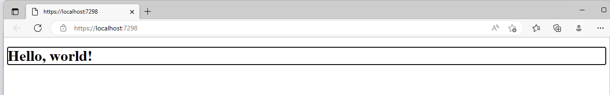
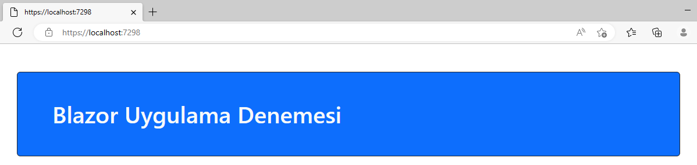
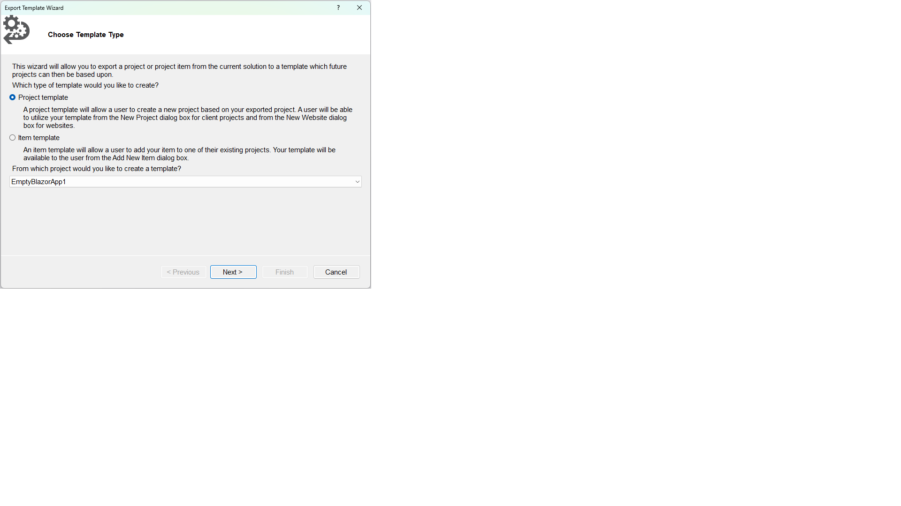
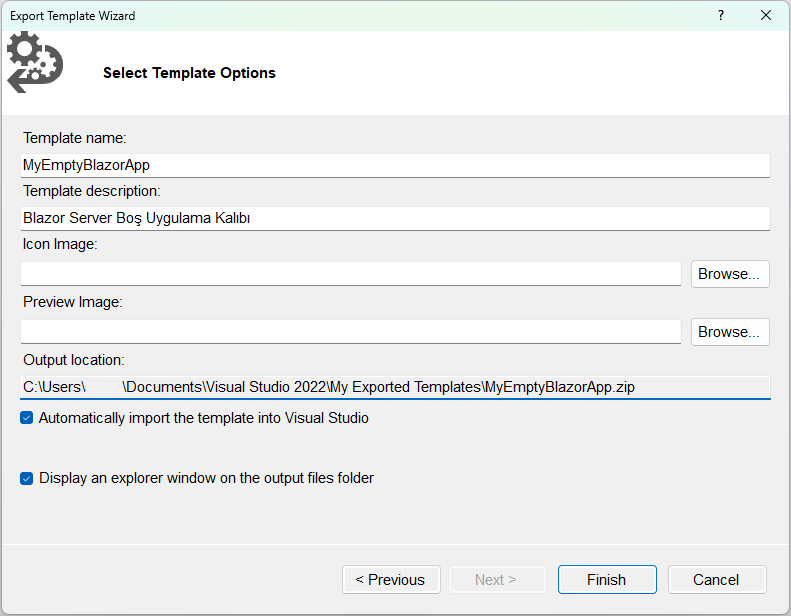

# EmptyBlazorApp1

Bu seçimle oluşturduğum ilk uygulama için Visual Studio
**"EmptyBlazorApp1"** ismini seçti, ben de bu ve sonraki seçimlerin
hepsini sorgusuz kabul ettim.
> *Keşif yapıyorsam da her adımda yeni bir macera arıyor değilim.*

## Açılış Sayfası 

Projede neyin nerede olduğuna bile bakmadan
CTRL+F5 ile Release modunda uygulamayı çalıştırdığımda,
önce geçici bir web sunucusunu başlatan komut penceresi açıldı,
sonra da "boş" uygulamanın sunduğu geçici içeriği
görüntüleyen bir web sayfası gördüm:



Bu standartlaşmış "Hello, world!" içeriği uygulamın "başlangıç sayfası"
diyebileceğimiz **Index.razor** sayfasından gelmiştir:

```
@page "/"

<h1>Hello, world!</h1>
```

Evet, sayfa içeriğinde HTML var, ama bu bir HTML sayfası değil,
bir "razor" sayfasıdır. İçeriğinde HTML harici kodlar da yer alabilir.
Örneğin, ilk satırdaki bildirim bu sayfanın uygulamanın kök (*root*)
sayfası olduğunu, alt sayfa adresi verilmemişse bu sayfanın
görüntüleneceğini belli ediyor.

### *Esrarengiz kenarlık hakkında*
Ama açılış sayfasındaki geçici içerik etrafında bir kenarlık vardı
(bkz. bir üstteki resim); acaba o nereden geldi?
Bu konuda sorulmuş bir
[soruya verilen cevaba](https://www.reddit.com/r/Blazor/comments/xl09d8/blazor_h1_element_is_focused_on_startup_for_no/)
göre, Blazor uygulaması görüntülediği sayfadaki **h1** öğesine
odaklanmıştı. Bunu yapan komut da uygulamanın "başlangıç kod dosyası"
diyebileceğimiz **App.razor** içindeydi:
```
<Router AppAssembly="@typeof(App).Assembly">
    <Found Context="routeData">
        <RouteView RouteData="@routeData" DefaultLayout="@typeof(MainLayout)" />
        <FocusOnNavigate RouteData="@routeData" Selector="h1" />
    </Found>
    <NotFound>
        <PageTitle>Not found</PageTitle>
        <LayoutView Layout="@typeof(MainLayout)">
            <p role="alert">Sorry, there's nothing at this address.</p>
        </LayoutView>
    </NotFound>
</Router>
```
Bulduğum cevapta önerildiği gibi,
**<FocusOnNavigate** ile başlayan kod satırını silerek
istemediğim kenarlıktan kurtuldum.

Bu vesileyle göz attığınız **App.razor** dosyasının kalan içeriğini
merak etmişseniz, `<Found Context=routeData>` kod bloku
uygulamanın tanıdığı bir adres görmesi durumunda ne yapacağını,
`<NotFound>`kod bloku da geçersiz bir adresle karşılaşması durumunda
ne yapacağını söylüyor.
> *Ben bu ilk uygulamamda bunlara dokunmadan geçiyorum.*

## Bootstrap Stillerinin Kullanımı

Her nedense Bootstrap stil kütüphanesini kullanmayı
pek sevdiğim için, Blazor uygulamalarımda da kullanmayı
denedim. Bunun için "uygulama sayfalarının HTML tabanı"
diyebileceğimiz **_Host.cshtml** sayfasına gerekli linki
koydum:
`<link href="css/bootstrap.css" rel="stylesheet" />`
> *Ben denemelerimi çevrimdışı yaptığım için
   kendi indirdiğim bootstrap.css dosyasını
   projenin **css** klasörüne ekledim ve
   onu gösteren bir link koydum.
   Siz isterseniz çevrimiçi bir bootstrap kaynağına link ekleyin.*

Yukarıda sözünü ettiğim **.cshtml** dosyasında
projenin **css** klasöründeki bir
**site.css** stil dosyasının da linki vardı.
O dosyaya uygulama sayfalarında kullanacağınız
kendi stil tanımlarınızı koyabilirsiniz.

## Açılış Sayfası İçeriğinin Düzenlenmesi

Açılış sayfası **index.razor** içeriğini aşağıdaki gibi değiştirdim:

```
@page "/"

<div class="container mt-5 bg-primary rounded border border-dark">
    <h1 class="m-5 display1 text-light">Blazor Uygulama Denemesi</h1>
</div>
```

Deneme çalıştırmasında sayfa şu şekilde gözüktü:



Bu ilk denemeyi daha ileriye götürmeden,
bu haliyle bırakmaya karar verdim.
Kodlar da içeren daha "işe yarar" uygulamalar geliştirken
artık bu ön adımları açıklamaya gerek duymayacağım.

## Kişisel Proje Kalıbı Oluşturulması

Yukarıda anlattığım ilk adımları bundan sonraki projelerde
uygulamamak için bu projeye dayalı yeni bir kişisel kalıp
(*template*) oluşturmak mantıklı olacaktı.

Visual Studio ortamında **Project** (Proje) menüsünden
**"Export Template"** (Kalıp Oluştur? Sür?) seçeneğini
tercih ederek yeni kalıbın dayalı olacağı bu ilk projeyi seçtim:



Sonra da bir isim ve açıklama ekleyerek yeni proje kalıbını oluşturdum:

