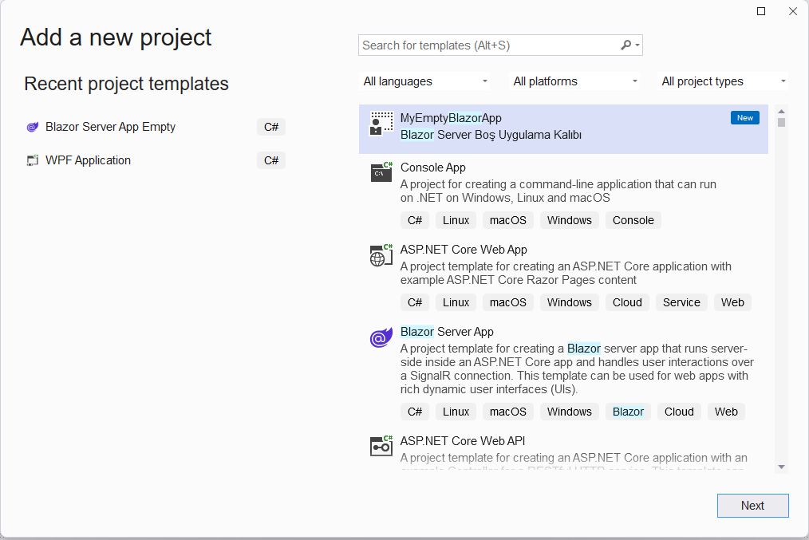
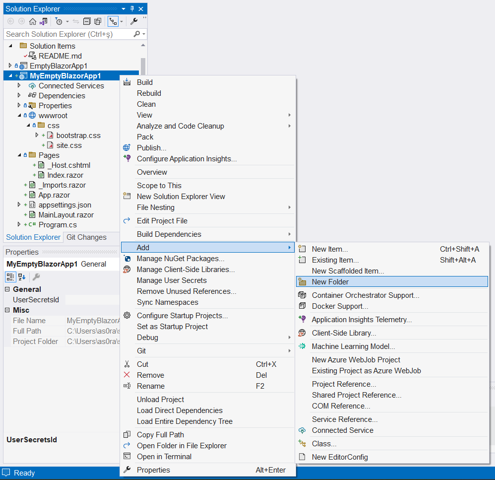

# MyEmptyBlazorApp1

Bu projeyi ilk projeye dayalı kişisel proje kalıbıyla oluşturdum:



> *Evet, proje kalıbına sözcükler arasında boşlukları olan
bir isim koymalıydım, ama geçti artık.*

Oluşturduğum proje kalıbının ilk örneği olduğu için
başlıktaki ismi aldı; her zamanki uysallığımla ismi
değiştirmeden kabul ettim.

**EmptyBlazorApp1** için yapmış olduğum tüm değişiklikler
bu projede aynen yer alıyordu. Hatta **bootstrap.css** dosyasıda
zaten projeye dahildi.
> Ama bir sorun vardı: Proje kalıbıyla gelen 
  **_Imports.razor** dosyasında eski projenin referansı
  hala duruyordu:<br>
  `@using EmptyBlazorApp1`<br>
  Bunu yeni proje adına referans yapacak şekilde
  değiştirdim:<br>
  `@using MyEmptyBlazorApp1`

## Nesne Sınıfları için Klasör Eklenmesi

Bu proje örneğiyle geliştireceğim uygulama
hayali hisse senetlerini listeleyecek.

Hayali hisse senetlerini temsil edecek bir sınıf tanımı
oluşturmakla işe başlayacağım.
Ama ondan da önce, bu sınıf tanımını koymak için
yeni bir proje klasörü oluşturmalıyım.

Hiç bilmeyenler için: Projeye klasör eklemek şöyle yapılıyor:



Teamüller gereği :-) bu proje klasörüne **"Models"** ismini verdim,
çünkü nesne modellerini içerecek.
Yani, tamam, tek bir model olacak içinde, ama olsun,
maksat işin raconuna uymak.
> Bu proje klasörüne ekleyeceğim sınıf tanımları
  projenin kendi ad uzayında (*namespace*) değil,
  klasör adını taşıyan bir alt ad uzayında olacaktır.
  O tanımları kodlarda kullanırken de bu alt uzay adını da
  eklemek gerekecekti.<br>
  Onun yerine, yukarıda sözünü ettiğim
  **_Imports.razor** dosyasına
  gerekli referansı kendim ekledim:<br>
  `@using Models`

## Nesneleri Temsil Edecek Sınıf Tanımı Eklenmesi

Artık sıra hayali hisseleri temsil edecek sınıf tanımını
eklemeye geldi.
Bu tanımı az önce oluşturduğum "Models" klasörüne ekledim:


Bu yeni sınıfın kod dosyası için önerilen geçici isim **Class1.s**
yerine kendi düşündüğüm **Hisse.cs** ismini uygun gördüm.

İşi basit tutmak için, daha önce bulduğum
[bir örnekteki](https://learn.microsoft.com/en-us/aspnet/core/blazor/tutorials/build-a-blazor-app?view=aspnetcore-7.0&pivots=server)
gibi, sınıf tanımına yalnızca hayali hissenin kodunu ve fiyatını
belirleyecek otomatik özellikler (*auto properties*) ekledim:

```
namespace MyEmptyBlazorApp1.Models
{
    public class Hisse
    {
        public int Id { get; set; }
        public string? Kod { get; set; }
        public double Fiyat { get; set; }
    }
}
```

Ben sınıf tanımını oluştururken "akıllı tamamlayıcı"
(*Intellisense* için uydurduğum isim)
**Id** adlı tamsayı özellik tanımını otomatik ekledi,
ben de yine uysallaşıp kabul ettim.
Ama bunu boşuna yapmadım; gelecekte model sınıfları
veri tablosu kayıtlarına dönüştüreceğimiz zaman
bu **Id** bilgisi otomatik artan "anahtar değer"
olarak işe yarayacaktır.

> Bilmeyenler için:
  (zaten bilenlerin burada ne işi olabilir ki?)<br>
  Hisse kodunun belirtilmediği durum olabileceği
  için, **Kod** özelliğinin türü **string?** olarak gözüküyor,
  yani boş adres (**null**) alabilecek bir referans değişkeni.

Ben bu ilkel projede veri tablosu kullanmadığım için
**Id** için otomatik değer atamayı kendim hallettim:

```
    // Kurucu fonksiyon Id için otomatik artan değer belirliyor,
    // varsa kod ve fiyat için gelen ilk değerleri atıyor.
    public Hisse(string? hisseKodu = null, double hisseFiyatı = 0)
    {
        hisseNo++;
        Id = hisseNo;

        Kod = hisseKodu;
        Fiyat = hisseFiyatı;
    }
```

## Index.razor Sayfasına Kodlar Eklenmesi

**Hisse** sınıfı türünden yeni bir nesne oluşturmak
için `new Hisse()` şeklinde bir komut yetecektir.
Böyle bir komut hisse kodu veya fiyatı için 
ilk değer göndermediği için kurucu fonksiyon
varsayılan ilk değerleri kullanacak,
yani **Kod** özelliğini boş (**null**) bırakacak,
**Fiyat** için de sayısal değer 0 olacak.

Ama istersek `new Hisse(AGAWC, 100)` şeklinde bir komutla,
kodunu ve fiyatını belirlediğimiz bir hisse nesnesi de
oluşturabiliriz.

Sorun şu ki, **Hisse** nesnelerini oluşturan kodları
nereye koyacağız? Bir .NET konsol uygulaması geliştiriyor
olsaydık, programın giriş noktası **Program.cs** adlı
kod dosyasındaki **Main** adlı fonksiyon olurdu.
Burada onlar yok. Asıl sunumu **.razor** uzantılı sayfalar
yapacak, ama onlar da HTML içeriğini oluşturmak için.

Ama sıkı durun: **.razor** uzantılı sayfalara içeriğini
oluşturacak kodları da ekleyebiliriz.

Sayfa dosyasının altına ekleyeceğimiz
```
@code {
    
}
```

bloku içinde değişken ve fonksiyon tanımları olabilir.

Şimdilik yalnızca deneme yaptığımız için
biz hisse nesneleri oluşturacak kodları
doğrudan ana sayfaya, yani **Index.razor** dosyasına ekledik:

```
@code {
    private List<Hisse> hisseler = new();

    public void HisseEkle()
    {
        hisseler.Add(Hisse.RasgeleHisse());
    }
}
```

Bu **@code** blokunda **Hisse** türü nesnelerin bir jenerik listesi
tanımlanmış, ve evet, bu liste tür belirtmeyen bir `new()`
çağrısıyla oluşturuluyor.

`HisseEkle()` adlı fonksiyon da bu listeye 
yeni bir **Hisse** nesnesi eklemek için.
Bu fonksiyon yeni hisseyi rasgele bir kod ve fiyat ile
oluşturan bir **static** fonksiyonu kullanıyor.
O fonksiyonu **Hisse.cs** kod dosyasında görebilirsiniz.
> *O fonksiyon hakkında ayrıntıya girmeyeceğim;
  konumuzun dışında kalıyor çünkü.*

## Index.razor Sayfasından Fonksiyon Çağrılması

Bu uygulama hisse senetlerinin bilgilerini
gerçek borsa verilerinden çekip almayacak;
ana sayfadaki bir düğme her tıklandığında
rasgele kod ve fiyatı olan
hayali bir hisse nesnesi oluşturacak.

Bu düğme tanımını **Index.razor** dosyasındaki
container türü div öğesinin içine yerleştirdik:
```
<div class="container mt-5 bg-primary rounded border border-dark">
    <h1 class="m-5 display1 text-light">Blazor Borsa Uygulaması</h1> 

    <button type="button" class="btn btn-light border rounded border-dark m-5"
            @onclick="HisseEkle">
        Hisse Ekle
    </button>

</div>
```

Tıklama olayını yanıtlayan fonksiyon referansına
dikkat edin: **.razor** sayfalarında
her türlü kod referansı **@** sembolüyle başlar.

## Index.razor Sayfasında Nesnelerin Listelenmesi

Ve artık sona geldik: **hisseler** adlı jenerik listedeki
nesneleri listeletmek için<br>
`@foreach (var hisse in hisseler)`<br>
şeklinde bir döngü açmalıyız.

Bu döngü içinde her **Hisse** nesnesini Bootstrap'in tanımladığı
card türü bir öğe içinde görüntülüyoruz.
Nesneye veya özelliklerine referans yaparken de
hep o **@** sembolünü kullanıyoruz:

```
<div class="container mt-5 bg-primary rounded border border-dark">
    <h1 class="m-5 display1 text-light">Blazor Borsa Uygulaması</h1> 

    <div class="row">
        @foreach (var hisse in hisseler)
        {
            <div class="card col-md-2 m-2">
                <h2 class="card-title m-2">@hisse.Kod</h2>
                <h3 class="card-footer m-2">@hisse.Fiyat</h3>
            </div>
        }
    </div>

    <button type="button" class="btn btn-light border rounded border-dark m-5"
            @onclick="HisseEkle">
        Hisse Ekle
    </button>

</div>
```

Bu eklemeleri de yapıp uygulamayı çalıştırırsanız
hayali hisse senetlerinin aşağıdaki resimdeki
gibi sıralandıklarını göreceksiniz:


