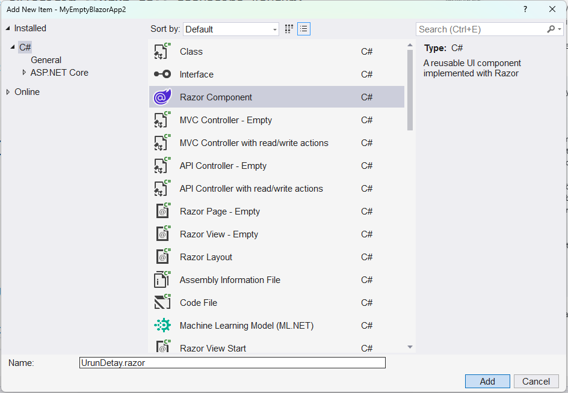
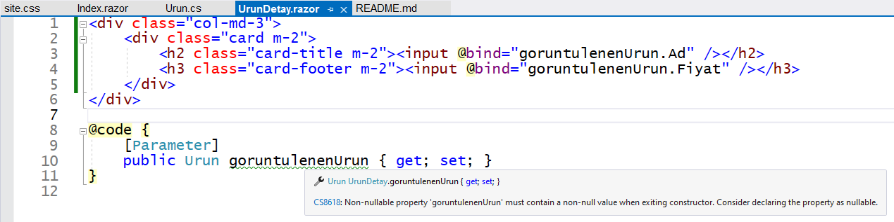
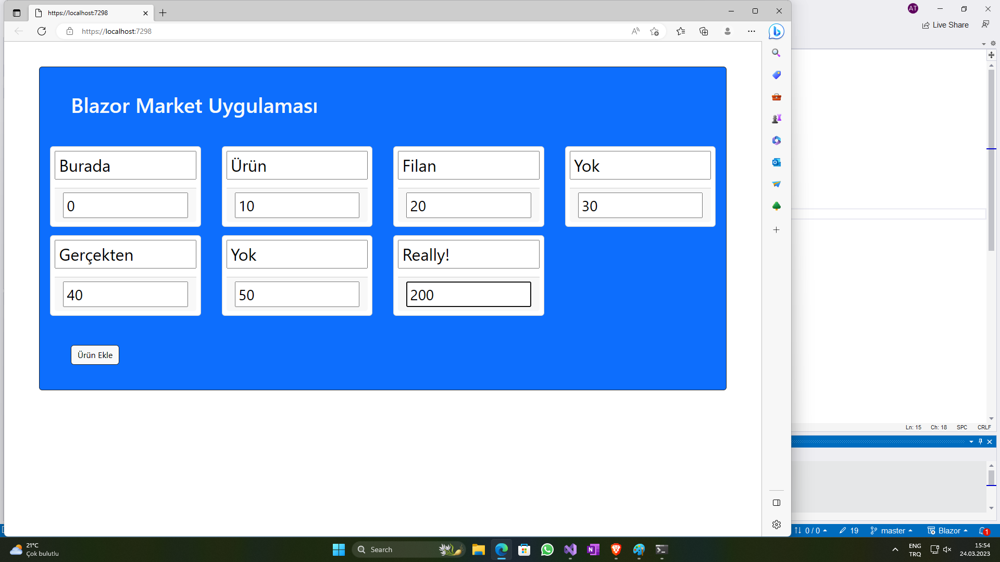

# MyEmptyBlazorApp2

Bu denememde de ilk denememizde oluşturduğum
kendi boş uygulama kalıbımı kullandım.

Bu kez hayali ürünleri listeleyecek bir uygulama geliştirecektim.
Yine bir "Ekle" düğmesiyle ürün eklemek niyetindeydim,
ama eklenen ürün adı ve fiyatını kendim girecektim.

Bunu önceki uygulamadaki gibi yapabilirdim;
tek yapmam gereken şey ürün adı ve fiyatını başlık öğelerinde
görüntülemek yerine elle bilgi girişine izin veren
**input** öğelerinde göstermekti.
Blazor'ın **@bind** direktifi sayesinde **input** öğelerinde
girilen bilgiler ürün adları ve fiyatlarına yansıyacaktı. 

## Alt Öğeler (Component) Ne İşe Yarar

Ama şöyle de bir durum vardı:
Ürün bilgi girişi için belki şimdi sade metin kutuları
yeterli olabilir, ama ya ileride bilgi giriş için farklı
yollar kullanmaya karar versem ne olacaktı?
O zaman bu uygulamanın ana sayfası **Index.razor**
içeriğinde ürün ayrıntılarını görüntüleyen öğeleri
yeniden düzenlemem gerekecekti.
Bu da kolay, ama ya başka uygulamalarda da ürün ayrıntılarını
gösterecek öğeler kullanmaya kalsam ne olacaktı?

İşte işi doğru yapmanın sırrı bu son cümlede gizliydi.
**Hisse** ya da **Urun**, ya da başka bir şey,
gerçek hayatta birden fazla uygulamada ayrıntılarını
düzenleme gereği hissedeceğim nesneleri görüntülemek
için kendi tasarladığım öğeleri kullanmam daha doğru olurdu.

Böylece, ayrıntıları görüntüleyecek veya düzenleme imkanı
sunacak öğelerim önceden hazır olurdu ve onları gelecek
uygulamalarımda da kullanırdım. Bu alt öğelerin görünümü
hakkında değişiklikleri yalnızca o öğeleri temsil eden
kod dosyalarında yapardım ve onları hazır kullanan
uygulamaların hepsini tekrar değiştirmem gerekmezdi.

Blazor Server uygulamalarında böyle bir öğe oluşturmak
için projeye bir "Razor Component" ekleriz.
Bu işlemle .razor uzantılı yeni bir dosya eklemiş
oluruz, ama bu yeni öğe bir Razor sayfası değil,
parametre alabilen bir alt öğedir.

## Projeye Alt Öğe (Component) eklenmesi

İşte bu nedenle, hayali ürünleri temsil edecek
**Urun** sınıfının yanında, bir de onun ayrıntılarını
görüntüleyecek bir alt öğe eklemeye karar verdim.

Bu projeye de model sınıfları barındıracak
"Models" adlı bir klasör ekledim.
Ürünleri temsil edecek **Urun** sınıf tanımını
bu klasöre eklediğim **Urun.cs** dosyasına koydum:

```
namespace MyEmptyBlazorApp2.Models
{
    public class Urun
    {
        public int Id { get; set; }
        public string Ad { get; set; }
        public double Fiyat { get; set; }

        // "Ad" özelliğinin türü string? değil, yani null değeri alamaz.
        // yani boş kurucu fonksiyonda hiç değilse boş bir string almalı.
        public Urun()
        {
            Ad = string.Empty;
            Fiyat = 0;
        }
    }
}
```
Projenin "Pages" klasörüne de ürün ayrıntılarını görüntüleyecek
bir alt öğe ekledim. Yeni bir proje öğesi eklemek için
"Pages" klasör simgesi üzerinde "Add" > "New Item"
menü seçeneklerini izledikten sonra "Razor Component" seçeneğini
tercih ettim ve bu alt öğeye uygun bir isim koydum:


## UrunDetay.razor Öğesinin Düzenlenmesi

Bu işlem sonucunda, alt öğe için **UrunDetay.razor** kod dosyasını
eklemiş oldum.
Bu dosyanın kod içeriğini önceki uygulamada hisse bilgilerini
görüntüleyen "card" türü öğeler gibi oluşturdum:
```
<div class="col-md-3">
    <div class="card m-2">
        <h2 class="card-title m-2"><input @bind="goruntulenenUrun.Ad" /></h2>
        <h3 class="card-footer m-2"><input @bind="goruntulenenUrun.Fiyat" /></h3>
    </div>
</div>
```
ama görüntülemenin yanında bilgi girişine de izin verecek
**input** öğeleri kullandım.

Bu **input** öğeleri **@bind** direktifleriyle
alt öğenin görüntüleyeceği ürünün
**Ad** ve **Fiyat** bilgilerine bağlıydılar.

Ama **goruntulenenUrun** nedir? Bu alt öğe onu dışarıdan
bir referans olarak almalıdır.
Bu referans bildirimi **UrunDetay.razor** dosyadındaki
**@code** bölümündedir:

```
@code {
    [Parameter]
    public Urun goruntulenenUrun { get; set; }
}
```

## UrunDetay Öğelerinin Ana Sayfada Kullanılması

Peki bu parametre nereden gelecek?<br>
Bu nokta çok önemlidir aslında,
çünkü -denemişseniz görmüşsünüzdür-
Visual Studio UrunDetay.razor kod dosyasında
bu referans değişkeninin kaynağı belirsiz diye uyarı veriyordu:



Bu uyarıyı ortadan kaldıracak bir önlem almadım ben,
çünkü her bir **UrunDetay** öğesi için görüntüleyeceği ürünün
referansı uygulamanın ana sayfasından gelecek.
Öyle biliyorum, çünkü öyle yapacağım.

Önceki denememdeki gibi, bu denemem için de
uygulama ana sayfasında hayali ürünleri temsil edecek
**Urun** türü nesneler listesi tanımlamıştım.
Yine tıklanınca yeni ürün oluşturup ekleyecek olan
bir düğmem vardı. Ama bu kez ürünleri doğrudan sayfa içinde
görüntülemiyordum. Onun yerine, her bir ürünün görüntüleme
işini bir **UrunDetay** öğesine bırakıyordum.
Parametre aktarımı işte o alt öğelerde gizlidir:

```
    @foreach (var urun in urunler)
    {
        <UrunDetay goruntulenenUrun="@urun" />
    }
```

Gördüğünüz gibi, projeye eklediğim bu öğeyi
tıpkı bir HTML öğesi gibi kullanıyorum.
Uygulama **urunler** listesindeki her bir
eleman için bir `<UrunDetay/>` öğesi
oluşturuyor. O öğeye de görüntülemekle
sorumlu olduğu **urun** elemanının referansını aktarıyor.

Diğer ayıntıları burada tekrarlamayacağız.
Liste oluşturulması veya yeni nesne eklenmesi
aynı önceki uygulamadaki gibiydi.

## Input Öğeleri için Stil Tanımlanması

Bu uygulamada farklı yaptığım tek şey,
bilgi girişi için kullandığım **input** öğelerinin
görünümünüyle ilgiliydi.

Metin kutuları içinde oldukları
**div** bölümlerinin dışına taşıyorlardı.
Bootstrap form öğesi stillerini kullanarak 
daha düzgün görünmelerini sağlayabilirdim.
Onun yerine, yaptığım arama sonucunda bulduğum
[bir cevapta](https://stackoverflow.com/questions/1633522/html-input-element-wider-than-containing-div)
önerilen yöntemi kullandım.

Uygulama sayfalarında kullanılacak ortak stillerin
tanımlandığı site.css dosyasına bütün input öğeleri
için geçerli olacak şu stil tanımını ekledim:

```
input {
    padding: 0.2em;
    box-sizing: border-box;
    width: 100%
} 
```

Çalıştırığım zaman uygulama aşağıdaki gibi gözüküyordu;
eklemeler ve düzenlemeler bile yaptım:

