Bu projeler grubu altında "Blazor Server App" şablonuyla
bazı deneme uygulamaları oluşturuyorum.
Bu belgeyi de *güya* benim gibi yeni öğrenenlere
yardım etmek için oluşturdum.
> *Asıl niyetim kendi keşif yolculuğum için bir günlük tutmak.*

Buradaki amacım daha alışık olduğum .NET platformu üzerinde,
iyi bildiğim C# programlama diliyle tek sayfalık web uygulamaları
(*single page web applications*) oluşturmak.

Bu gruptaki hemen hemen her projeyi **"Blazor Server App Empty"**
(Blazor Server Boş Uygulama) kalıbıyla oluşturacağım:


Dikkat etmişsinizdir, "blazor" terimiyle yaptığım arama sonucunda
"Boş" (*Empty*) olmayan Blazor uygulaması kalıpları da var.
Bunlar belli bir iskelet üzerinde geçici içerikler sunacaklardır.
yeni başlayan birisi için öylesi daha faydalı olacak sanabilirsiniz,
ama iş kendi içeriğinizi kendi düzeninizle sunmaya gelince,
o kurulum iskeleti ve geçici içerikleri silmekle uğraşmanız gerekebilir.
Öylesi benim işime gelmediği için, boş kalıpla başlamayı tercih ettim.

# EmptyBlazorApp1

Bu seçimle oluşturduğum ilk uygulama için Visual Studio
**"EmptyBlazorApp1"** ismini seçti, ben de bu ve sonraki seçimlerin
hepsini sorgusuz kabul ettim.
> *Keşif yapıyorsam da her adımda yeni bir macera arıyor değilim.*

## Açılış Sayfası

Projede neyin nerede olduğuna bile bakmadan
CTRL+F5 ile Release modunda uygulamayı çalıştırdığımda,
önce geçici bir web sunucusunu başlatan komut penceresi açıldı,
sonra da "boş" uygulamanın sunduğu geçici içeriği
görüntüleyen bir web sayfası gördüm:

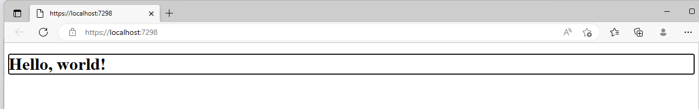

Bu standartlaşmış "Hello, world!" içeriği uygulamın "başlangıç sayfası"
diyebileceğimiz **Index.razor** sayfasından gelmiştir:

```
@page "/"

<h1>Hello, world!</h1>
```

Evet, sayfa içeriğinde HTML var, ama bu bir HTML sayfası değil,
bir "razor" sayfasıdır. İçeriğinde HTML harici kodlar da yer alabilir.
Örneğin, ilk satırdaki bildirim bu sayfanın uygulamanın kök (*root*)
sayfası olduğunu, alt sayfa adresi verilmemişse bu sayfanın
görüntüleneceğini belli ediyor.

### *Esrarengiz kenarlık hakkında*
Ama açılış sayfasındaki geçici içerik etrafında bir kenarlık vardı
(bkz. bir üstteki resim); acaba o nereden geldi?
Bu konuda sorulmuş bir
[soruya verilen cevaba](https://www.reddit.com/r/Blazor/comments/xl09d8/blazor_h1_element_is_focused_on_startup_for_no/)
göre, Blazor uygulaması görüntülediği sayfadaki **h1** öğesine
odaklanmıştı. Bunu yapan komut da uygulamanın "başlangıç kod dosyası"
diyebileceğimiz **App.razor** içindeydi:
```
<Router AppAssembly="@typeof(App).Assembly">
    <Found Context="routeData">
        <RouteView RouteData="@routeData" DefaultLayout="@typeof(MainLayout)" />
        <FocusOnNavigate RouteData="@routeData" Selector="h1" />
    </Found>
    <NotFound>
        <PageTitle>Not found</PageTitle>
        <LayoutView Layout="@typeof(MainLayout)">
            <p role="alert">Sorry, there's nothing at this address.</p>
        </LayoutView>
    </NotFound>
</Router>
```
Bulduğum cevapta önerildiği gibi,
**<FocusOnNavigate** ile başlayan kod satırını silerek
istemediğim kenarlıktan kurtuldum.

Bu vesileyle göz attığınız **App.razor** dosyasının kalan içeriğini
merak etmişseniz, `<Found Context=routeData>` kod bloku
uygulamanın tanıdığı bir adres görmesi durumunda ne yapacağını,
`<NotFound>`kod bloku da geçersiz bir adresle karşılaşması durumunda
ne yapacağını söylüyor.
> *Ben bu ilk uygulamamda bunlara dokunmadan geçiyorum.*

## Bootstrap Stillerinin Kullanımı

Her nedense Bootstrap stil kütüphanesini kullanmayı
pek sevdiğim için, Blazor uygulamalarımda da kullanmayı
denedim. Bunun için "uygulama sayfalarının HTML tabanı"
diyebileceğimiz **_Host.cshtml** sayfasına gerekli linki
koydum:
`<link href="css/bootstrap.css" rel="stylesheet" />`
> *Ben denemelerimi çevrimdışı yaptığım için
   kendi indirdiğim bootstrap.css dosyasını
   projenin **css** klasörüne ekledim ve
   onu gösteren bir link koydum.
   Siz isterseniz çevrimiçi bir bootstrap kaynağına link ekleyin.*

Yukarıda sözünü ettiğim **.cshtml** dosyasında
projenin **css** klasöründeki bir
**site.css** stil dosyasının da linki vardı.
O dosyaya uygulama sayfalarında kullanacağınız
kendi stil tanımlarınızı koyabilirsiniz.

## Açılış Sayfası İçeriğinin Düzenlenmesi

Açılış sayfası **index.razor** içeriğini aşağıdaki gibi değiştirdim:

```
@page "/"

<div class="container mt-5 bg-primary rounded border border-dark">
    <h1 class="m-5 display1 text-light">Blazor Uygulama Denemesi</h1>
</div>
```

Deneme çalıştırmasında sayfa şu şekilde gözüktü:

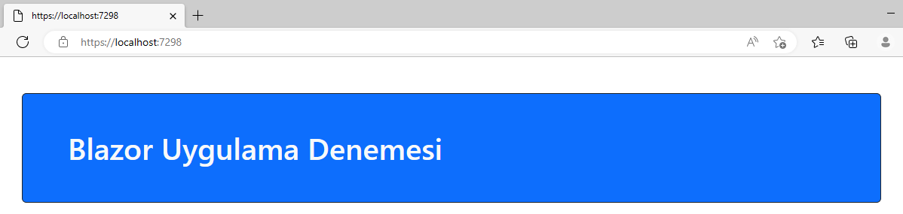

Bu ilk denemeyi daha ileriye götürmeden,
bu haliyle bırakmaya karar verdim.
Kodlar da içeren daha "işe yarar" uygulamalar geliştirken
artık bu ön adımları açıklamaya gerek duymayacağım.

## Kişisel Proje Kalıbı Oluşturulması

Yukarıda anlattığım ilk adımları bundan sonraki projelerde
uygulamamak için bu projeye dayalı yeni bir kişisel kalıp
(*template*) oluşturmak mantıklı olacaktı.

Visual Studio ortamında **Project** (Proje) menüsünden
**"Export Template"** (Kalıp Oluştur? Sür?) seçeneğini
tercih ederek yeni kalıbın dayalı olacağı bu ilk projeyi seçtim:

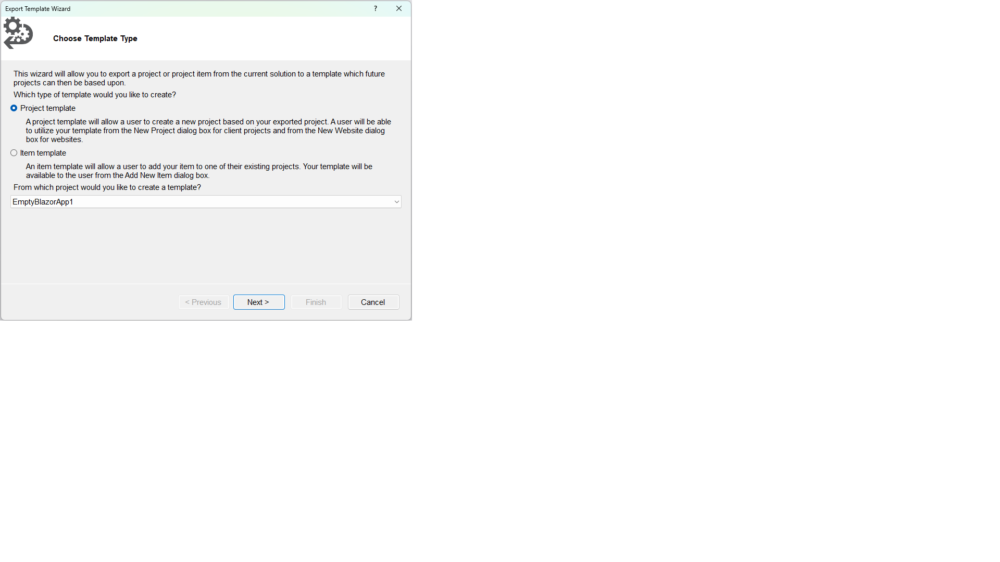

Sonra da bir isim ve açıklama ekleyerek yeni proje kalıbını oluşturdum:

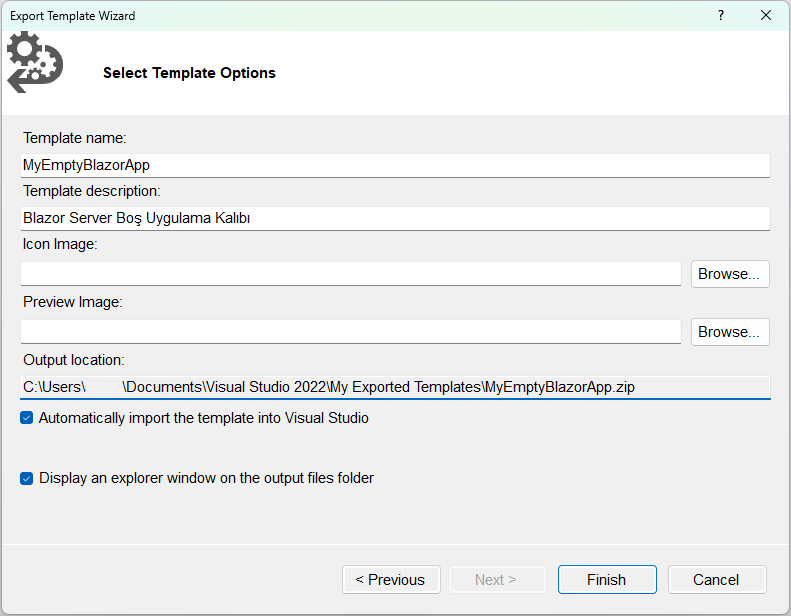

# MyEmptyBlazorApp1

Bu projeyi ilk projeye dayalı kişisel proje kalıbıyla oluşturdum:

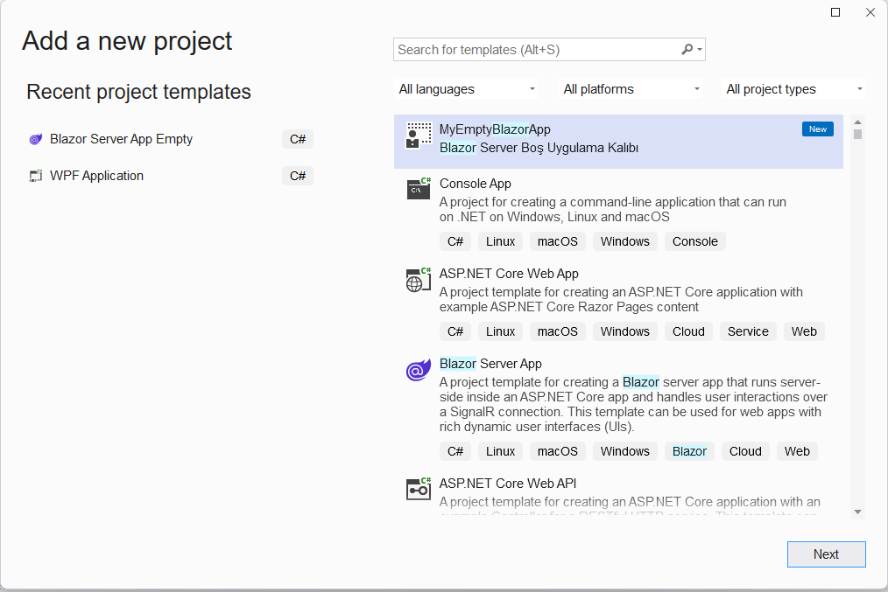

> *Evet, proje kalıbına sözcükler arasında boşlukları olan
bir isim koymalıydım, ama geçti artık.*

Oluşturduğum proje kalıbının ilk örneği olduğu için
başlıktaki ismi aldı; her zamanki uysallığımla ismi
değiştirmeden kabul ettim.

**EmptyBlazorApp1** için yapmış olduğum tüm değişiklikler
bu projede aynen yer alıyordu. Hatta **bootstrap.css** dosyasıda
zaten projeye dahildi.
> Ama bir sorun vardı: Proje kalıbıyla gelen 
  **_Imports.razor** dosyasında eski projenin referansı
  hala duruyordu:<br>
  `@using EmptyBlazorApp1`<br>
  Bunu yeni proje adına referans yapacak şekilde
  değiştirdim:<br>
  `@using MyEmptyBlazorApp1`

## Nesne Sınıfları için Klasör Eklenmesi

Bu proje örneğiyle geliştireceğim uygulama
hayali hisse senetlerini listeleyecek.

Hayali hisse senetlerini temsil edecek bir sınıf tanımı
oluşturmakla işe başlayacağım.
Ama ondan da önce, bu sınıf tanımını koymak için
yeni bir proje klasörü oluşturmalıyım.

Hiç bilmeyenler için: Projeye klasör eklemek şöyle yapılıyor:

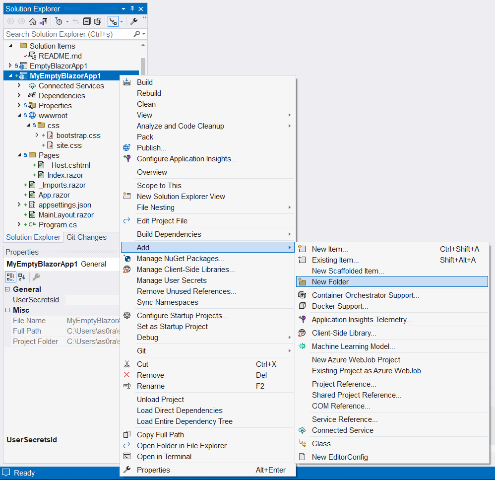

Teamüller gereği :-) bu proje klasörüne **"Models"** ismini verdim,
çünkü nesne modellerini içerecek.
Yani, tamam, tek bir model olacak içinde, ama olsun,
maksat işin raconuna uymak.
> Bu proje klasörüne ekleyeceğim sınıf tanımları
  projenin kendi ad uzayında (*namespace*) değil,
  klasör adını taşıyan bir alt ad uzayında olacaktır.
  O tanımları kodlarda kullanırken de bu alt uzay adını da
  eklemek gerekecekti.<br>
  Onun yerine, yukarıda sözünü ettiğim
  **_Imports.razor** dosyasına
  gerekli referansı kendim ekledim:<br>
  `@using Models`

## Nesneleri Temsil Edecek Sınıf Tanımı Eklenmesi

Artık sıra hayali hisseleri temsil edecek sınıf tanımını
eklemeye geldi.
Bu tanımı az önce oluşturduğum "Models" klasörüne ekledim:

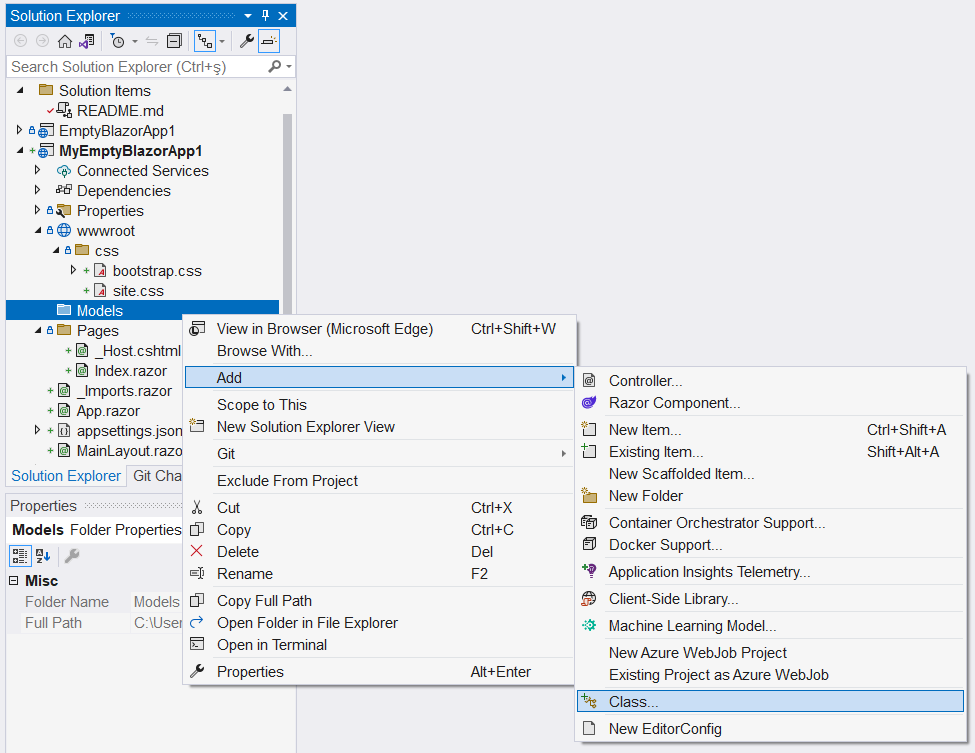

Bu yeni sınıfın kod dosyası için önerilen geçici isim **Class1.s**
yerine kendi düşündüğüm **Hisse.cs** ismini uygun gördüm.

İşi basit tutmak için, daha önce bulduğum
[bir örnekteki](https://learn.microsoft.com/en-us/aspnet/core/blazor/tutorials/build-a-blazor-app?view=aspnetcore-7.0&pivots=server)
gibi, sınıf tanımına yalnızca hayali hissenin kodunu ve fiyatını
belirleyecek otomatik özellikler (*auto properties*) ekledim:

```
namespace MyEmptyBlazorApp1.Models
{
    public class Hisse
    {
        public int Id { get; set; }
        public string? Kod { get; set; }
        public double Fiyat { get; set; }
    }
}
```

Ben sınıf tanımını oluştururken "akıllı tamamlayıcı"
(*Intellisense* için uydurduğum isim)
**Id** adlı tamsayı özellik tanımını otomatik ekledi,
ben de yine uysallaşıp kabul ettim.
Ama bunu boşuna yapmadım; gelecekte model sınıfları
veri tablosu kayıtlarına dönüştüreceğimiz zaman
bu **Id** bilgisi otomatik artan "anahtar değer"
olarak işe yarayacaktır.

> Bilmeyenler için:
  (zaten bilenlerin burada ne işi olabilir ki?)<br>
  Hisse kodunun belirtilmediği durum olabileceği
  için, **Kod** özelliğinin türü **string?** olarak gözüküyor,
  yani boş adres (**null**) alabilecek bir referans değişkeni.

Ben bu ilkel projede veri tablosu kullanmadığım için
**Id** için otomatik değer atamayı kendim hallettim:

```
    // Kurucu fonksiyon Id için otomatik artan değer belirliyor,
    // varsa kod ve fiyat için gelen ilk değerleri atıyor.
    public Hisse(string? hisseKodu = null, double hisseFiyatı = 0)
    {
        hisseNo++;
        Id = hisseNo;

        Kod = hisseKodu;
        Fiyat = hisseFiyatı;
    }
```

## Index.razor Sayfasına Kodlar Eklenmesi

**Hisse** sınıfı türünden yeni bir nesne oluşturmak
için `new Hisse()` şeklinde bir komut yetecektir.
Böyle bir komut hisse kodu veya fiyatı için 
ilk değer göndermediği için kurucu fonksiyon
varsayılan ilk değerleri kullanacak,
yani **Kod** özelliğini boş (**null**) bırakacak,
**Fiyat** için de sayısal değer 0 olacak.

Ama istersek `new Hisse(AGAWC, 100)` şeklinde bir komutla,
kodunu ve fiyatını belirlediğimiz bir hisse nesnesi de
oluşturabiliriz.

Sorun şu ki, **Hisse** nesnelerini oluşturan kodları
nereye koyacağız? Bir .NET konsol uygulaması geliştiriyor
olsaydık, programın giriş noktası **Program.cs** adlı
kod dosyasındaki **Main** adlı fonksiyon olurdu.
Burada onlar yok. Asıl sunumu **.razor** uzantılı sayfalar
yapacak, ama onlar da HTML içeriğini oluşturmak için.

Ama sıkı durun: **.razor** uzantılı sayfalara içeriğini
oluşturacak kodları da ekleyebiliriz.

Sayfa dosyasının altına ekleyeceğimiz
```
@code {
    
}
```

bloku içinde değişken ve fonksiyon tanımları olabilir.

Şimdilik yalnızca deneme yaptığımız için
biz hisse nesneleri oluşturacak kodları
doğrudan ana sayfaya, yani **Index.razor** dosyasına ekledik:

```
@code {
    private List<Hisse> hisseler = new();

    public void HisseEkle()
    {
        hisseler.Add(Hisse.RasgeleHisse());
    }
}
```

Bu **@code** blokunda **Hisse** türü nesnelerin bir jenerik listesi
tanımlanmış, ve evet, bu liste tür belirtmeyen bir `new()`
çağrısıyla oluşturuluyor.

`HisseEkle()` adlı fonksiyon da bu listeye 
yeni bir **Hisse** nesnesi eklemek için.
Bu fonksiyon yeni hisseyi rasgele bir kod ve fiyat ile
oluşturan bir **static** fonksiyonu kullanıyor.
O fonksiyonu **Hisse.cs** kod dosyasında görebilirsiniz.
> *O fonksiyon hakkında ayrıntıya girmeyeceğim;
  konumuzun dışında kalıyor çünkü.*

## Index.razor Sayfasından Fonksiyon Çağrılması

Bu uygulama hisse senetlerinin bilgilerini
gerçek borsa verilerinden çekip almayacak;
ana sayfadaki bir düğme her tıklandığında
rasgele kod ve fiyatı olan
hayali bir hisse nesnesi oluşturacak.

Bu düğme tanımını **Index.razor** dosyasındaki
container türü div öğesinin içine yerleştirdik:
```
<div class="container mt-5 bg-primary rounded border border-dark">
    <h1 class="m-5 display1 text-light">Blazor Borsa Uygulaması</h1> 

    <button type="button" class="btn btn-light border rounded border-dark m-5"
            @onclick="HisseEkle">
        Hisse Ekle
    </button>

</div>
```

Tıklama olayını yanıtlayan fonksiyon referansına
dikkat edin: **.razor** sayfalarında
her türlü kod referansı **@** sembolüyle başlar.

## Index.razor Sayfasında Nesnelerin Listelenmesi

Ve artık sona geldik: **hisseler** adlı jenerik listedeki
nesneleri listeletmek için<br>
`@foreach (var hisse in hisseler)`<br>
şeklinde bir döngü açmalıyız.

Bu döngü içinde her **Hisse** nesnesini Bootstrap'in tanımladığı
card türü bir öğe içinde görüntülüyoruz.
Nesneye veya özelliklerine referans yaparken de
hep o **@** sembolünü kullanıyoruz:

```
<div class="container mt-5 bg-primary rounded border border-dark">
    <h1 class="m-5 display1 text-light">Blazor Borsa Uygulaması</h1> 

    <div class="row">
        @foreach (var hisse in hisseler)
        {
            <div class="card col-md-2 m-2">
                <h2 class="card-title m-2">@hisse.Kod</h2>
                <h3 class="card-footer m-2">@hisse.Fiyat</h3>
            </div>
        }
    </div>

    <button type="button" class="btn btn-light border rounded border-dark m-5"
            @onclick="HisseEkle">
        Hisse Ekle
    </button>

</div>
```

Bu eklemeleri de yapıp uygulamayı çalıştırırsanız
hayali hisse senetlerinin aşağıdaki resimdeki
gibi sıralandıklarını göreceksiniz:

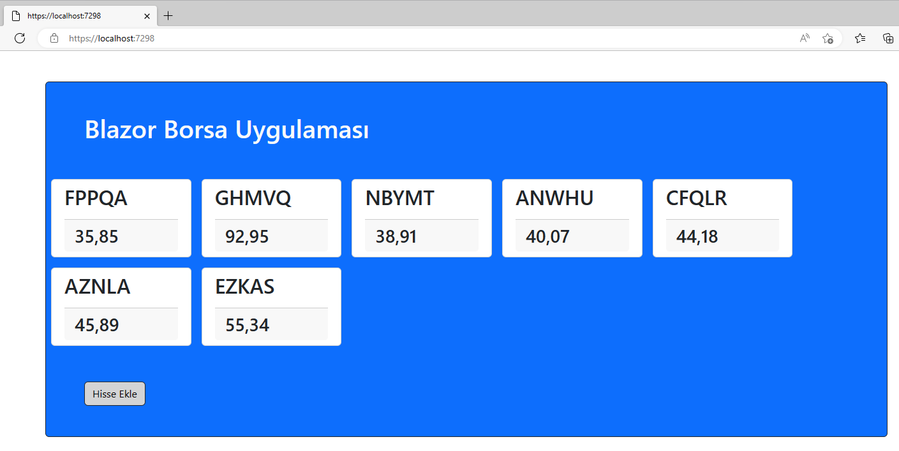

# MyEmptyBlazorApp2

Bu denememde de ilk denememizde oluşturduğum
kendi boş uygulama kalıbımı kullandım.

Bu kez hayali ürünleri listeleyecek bir uygulama geliştirecektim.
Yine bir "Ekle" düğmesiyle ürün eklemek niyetindeydim,
ama eklenen ürün adı ve fiyatını kendim girecektim.

Bunu önceki uygulamadaki gibi yapabilirdim;
tek yapmam gereken şey ürün adı ve fiyatını başlık öğelerinde
görüntülemek yerine elle bilgi girişine izin veren
**input** öğelerinde göstermekti.
Blazor'ın **@bind** direktifi sayesinde **input** öğelerinde
girilen bilgiler ürün adları ve fiyatlarına yansıyacaktı.

## Alt Öğeler (Component) Ne İşe Yarar

Ama şöyle de bir durum vardı:
Ürün bilgi girişi için belki şimdi sade metin kutuları
yeterli olabilir, ama ya ileride bilgi giriş için farklı
yollar kullanmaya karar versem ne olacaktı?
O zaman bu uygulamanın ana sayfası **Index.razor**
içeriğinde ürün ayrıntılarını görüntüleyen öğeleri
yeniden düzenlemem gerekecekti.
Bu da kolay, ama ya başka uygulamalarda da ürün ayrıntılarını
gösterecek öğeler kullanmaya kalsam ne olacaktı?

İşte işi doğru yapmanın sırrı bu son cümlede gizliydi.
Hisse ya da Ürün, ya da başka bir şey,
gerçek hayatta birden fazla uygulamada ayreıntılarını
düzenleme gereği hissedeceğim nesneleri görüntülemek
için kendi tasarladığım öğeleri kullanmam daha doğru olurdu.

Böylece, ayrıntıları görüntüleyecek veya düzenleme imkanı
sunacak öğelerim önceden hazır olurdu ve onları gelecek
uygulamalarımda da kullanırdım. Bu alt öğelerin görünümü
hakkında değişiklikleri yalnızca o öğeleri temsil eden
kod dosyalarında yapardım ve onları hazır kullanan
uygulamaların hepsini tekrar değiştirmem gerekmezdi.

Blazor Server uygulamalarında böyle bir öğe oluşturmak
için projeye bir "Razor Component" ekleriz.
Bu işlemle .razor uzantılı yeni bir dosya eklemiş
oluruz, ama bu yeni öğe bir Razor sayfası değil,
parametre alabilen bir alt öğedir.

## Projeye Alt Öğe (Component) eklenmesi

İşte bu nedenle, hayali ürünleri temsil edecek
Urun sınıfının yanında, bir de onun ayrıntılarını
görüntüleyecek bir alt öğe eklemeye karar verdim.

Bu projeye de model sınıfları barındıracak
"Models" adlı bir klasör ekledim.
Ürünleri temsil edecek **Urun** sınıf tanımını
bu klasöre eklediğim **Urun.cs** dosyasına koydum:

```
namespace MyEmptyBlazorApp2.Models
{
    public class Urun
    {
        public int Id { get; set; }
        public string Ad { get; set; }
        public double Fiyat { get; set; }

        // "Ad" özelliğinin türü string? değil, yani null değeri alamaz.
        // yani boş kurucu fonksiyonda hiç değilse boş bir string almalı.
        public Urun()
        {
            Ad = string.Empty;
            Fiyat = 0;
        }
    }
}
```
Projenin "Pages" klasörüne de ürün ayrıntılarını görüntüleyecek
bir alt öğe ekledim. Yeni bir proje öğesi eklemek için
"Pages" klasör simgesi üzerinde "Add" > "New Item"
menü seçeneklerini izledikten sonra "Razor Component" seçeneğini
tercih ettim ve bu alt öğeye uygun bir isim koydum:


## UrunDetay.razor Öğesinin Düzenlenmesi

Bu işlem sonucunda, alt öğe için **UrunDetay.razor** kod dosyasını
eklemiş oldum.
Bu dosyanın kod içeriğini önceki uygulamada hisse bilgilerini
görüntüleyen "card" türü öğeler gibi oluşturdum:
```
<div class="col-md-3">
    <div class="card m-2">
        <h2 class="card-title m-2"><input @bind="goruntulenenUrun.Ad" /></h2>
        <h3 class="card-footer m-2"><input @bind="goruntulenenUrun.Fiyat" /></h3>
    </div>
</div>
```
ama görüntülemenin yanında bilgi girişine de izin verecek
**input** öğeleri kullandım.

Bu **input** öğeleri **@bind** direktifleriyle
alt öğenin görüntüleyeceği ürünün
**Ad** ve **Fiyat** bilgilerine bağlıydılar.

Ama **goruntulenenUrun** nedir? Bu alt öğe onu dışarıdan
bir referans olarak almalıdır.
Bu referans bildirimi **UrunDetay.razor** dosyadındaki
**@code** bölümündedir:

```
@code {
    [Parameter]
    public Urun goruntulenenUrun { get; set; }
}
```

## UrunDetay Öğelerinin Ana Sayfada Kullanılması

Peki bu parametre nereden gelecek?<br>
Bu nokta çok önemlidir aslında,
çünkü -denemişseniz görmüşsünüzdür-
Visual Studio UrunDetay.razor kod dosyasında
bu referans değişkeninin kaynağı belirsiz diye uyarı veriyordu:

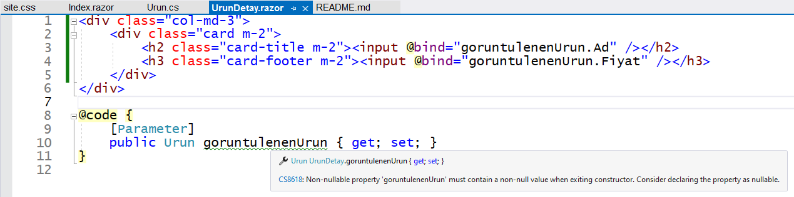

Bu uyarıyı ortadan kaldıracak bir önlem almadım ben,
çünkü her bir **UrunDetay** öğesi için görüntüleyeceği ürünün
referansı uygulamanın ana sayfasından gelecek.
Öyle biliyorum, çünkü öyle yapacağım.

Önceki denememdeki gibi, bu denemem için de
uygulama ana sayfasında hayali ürünleri temsil edecek
**Urun** türü nesneler listesi tanımlamıştım.
Yine tıklanınca yeni ürün oluşturup ekleyecek olan
bir düğmem vardı. Ama bu kez ürünleri doğrudan sayfa içinde
görüntülemiyordum. Onun yerine, her bir ürünün görüntüleme
işini bir **UrunDetay** öğesine bırakıyordum.
Parametre aktarımı işte o alt öğelerde gizlidir:

```
    @foreach (var urun in urunler)
    {
        <UrunDetay goruntulenenUrun="@urun" />
    }
```

Gördüğünüz gibi, projeye eklediğim bu öğeyi
tıpkı bir HTML öğesi gibi kullanıyorum.
Uygulama **urunler** listesindeki her bir
eleman için bir `<UrunDetay/>` öğesi
oluşturuyor. O öğeye de görüntülemekle
sorumlu olduğu **urun** elemanının referansını aktarıyor.

Diğer ayıntıları burada tekrarlamayacağız.
Liste oluşturulması veya yeni nesne eklenmesi
aynı önceki uygulamadaki gibiydi.

## Input Öğeleri için Stil Tanımlanması

Bu uygulamada farklı yaptığım tek şey,
bilgi girişi için kullandığım **input** öğelerinin
görünümünüyle ilgiliydi.

Metin kutuları içinde oldukları
**div** bölümlerinin dışına taşıyorlardı.
Bootstrap form öğesi stillerini kullanarak 
daha düzgün görünmelerini sağlayabilirdim.
Onun yerine, yaptığım arama sonucunda bulduğum
[bir cevapta](https://stackoverflow.com/questions/1633522/html-input-element-wider-than-containing-div)
önerilen yöntemi kullandım.

Uygulama sayfalarında kullanılacak ortak stillerin
tanımlandığı site.css dosyasına bütün input öğeleri
için geçerli olacak şu stil tanımını ekledim:

```
input {
    padding: 0.2em;
    box-sizing: border-box;
    width: 100%
} 
```

Çalıştırığım zaman uygulama aşağıdaki gibi gözüküyordu;
eklemeler ve düzenlemeler bile yaptım:

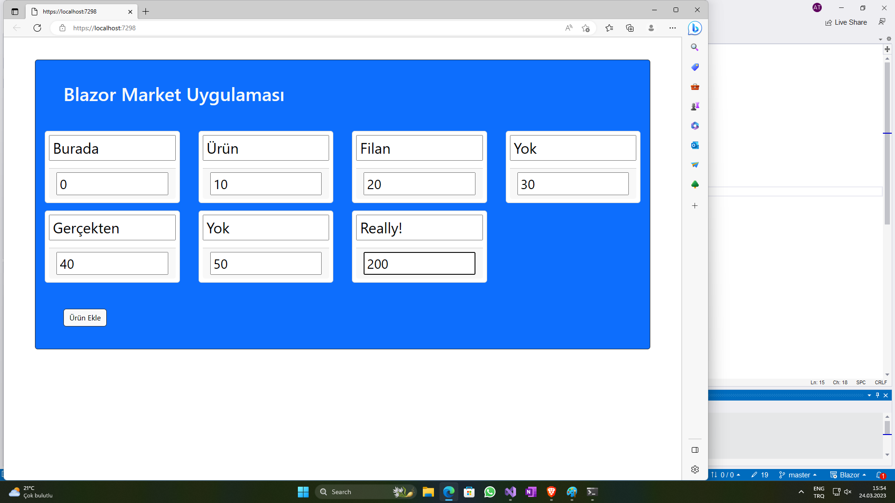

# BlazorMarket

Bu denememde boş olmayan "Blazor Server App" proje kalıbını kullandım.
Bu seçim projeye ileride veritabanı bağlantılarında kullanabileceğim
bir altyapı eklemiş oldu. Ya da ben öyle sanıyorum.
Çok da önemli de değil; henüz bir veritabanıyla muhatap olacak
bir uygulama geliştirmeye çalışmıyorum.
Daha hala arayüz tasarımı konusunda ilerlemeye çalışıyorum.

Her neyse, bu projede pencerelerin görünüm düzenlerini
(*layout*) ne mavigasyon menülerini içeren bir **Shared** klasörü
ve bir de veri alışverişi sağlayacak servis tanımlarının
konacağı bir **Data** klasörü var.

Uygulamanın şimdiki ilk halinde bile bir şeyler yapan
içeriği var; ana sayfa bazı linklerle açılıyor.
Soldaki menüden "Counter" (Sayaç) seçeneğini tıklayınca,
çıkan sayfada tıklandıkça bir sayaç değerini arttıran bir düğme var:

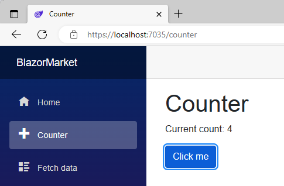

Sol menüdeki "Fetch Data" seçeneği de gaipten
hayali hava durumu verileri alıp getiren bir sayfa açıyor.

## Hazır Gelen İçeriğin Silinmesi

Bu uygulamada ana sayfadaki ankete, sayaç arttıran düğmeye
ve hayali hava durumu verilerini almaya gerek duymayacağım.
O nedenle, projenin **Sayfalar** klasöründen
"Counter.razor" ve "FetchData.razor" dosyalarını,
**Data** klasöründen de WeatherForecast... diye başlayan
dosyaları sildim.

Hemen de bilinçsiz iş yapmamın cezasını gördüm.
Visual Studio artık geçersiz kalan bir referans hakkında
hata mesajı veriyordu:

```
The type or namespace name 'Data' does not exist in the namespace 'BlazorMarket' (are you missing an assembly reference?)
```

Bunun nedeni Data klasörü içeriğini tümden silmiş olmamdı.
O klasör normalde projeye eklenecek veri sağlama servisleri
için gerekebilir, yani referansı olmalıdır,
ama bu uygulamaya şu an için öyle bir yetenek eklemeyeceğim.

Bu nedenle hatanın kaynağı olan Program.cs dosyasının
başındaki `using BlazorMarket.Data;` referansını
geçici olarak açıklama satırına dönüştürdüm.
Hava durumu servisi ekleyen
```
builder.Services.AddSingleton<WeatherForecastService>();
```

komutunu da aynı şekilde gizledim.

"NavMenu.razor" dosyasına gidip, menü seçeneklerini de
sildim; yalnızca ana sayfaya erişen seçenek kaldı,
onun da içeriğini değiştirdim:

```
<div class="@NavMenuCssClass nav-scrollable" @onclick="ToggleNavMenu">
    <nav class="flex-column">
        <div class="nav-item px-3">
            <NavLink class="nav-link" href="" Match="NavLinkMatch.All">
                <span class="oi oi-home" aria-hidden="true"></span> Market
            </NavLink>
        </div>
    </nav>
</div>
```

Ana sayfa Index.razor başlığını da bir önceki boş uygulama
projemdeki gibi yaptım:

```
@page "/"

<PageTitle>Market</PageTitle>

<div class="container mt-5 bg-primary rounded border border-dark">
    <h1 class="m-5 display1 text-light">Blazor Market Uygulaması</h1>

</div>
```

İlginçtir, ana sayfa tıpkı önceki uygulamadaki gibi gözüküyordu.
Yani, en azından Bootstrap sınıf tanımları zaten vardı.
Proje organizasyonuna bakarsanız, gerçekten de,
**wwwroot/css** klasöründe **bootstrap.min.css**
referansını bulacaksınız.

Hatta, uygulama sayfalarında ortak kullanılacak
stil tanımlarını içeren **site.css** dosyasında da
önceki boş uygulamada kurtulmaya çalıştığım
esrarengşz kenarlığı iptal eden şu tanım vardı:
```
h1:focus {
    outline: none;
}
```

## Ana Sayfanın Planlanması

Bu uygulamada ürün kategorileri olacak ve
kategorilere ait ürünler olacak.
Bunları bir veritabanından almayacağım,
onu yerine, kodlarla kendi tanımladığım
nesnelerde oluşan listeleri görüntüleyeceğim.

Kısacası, aşağıdaki gibi bir yerleşim düzeni
oluşturmayı planladım:

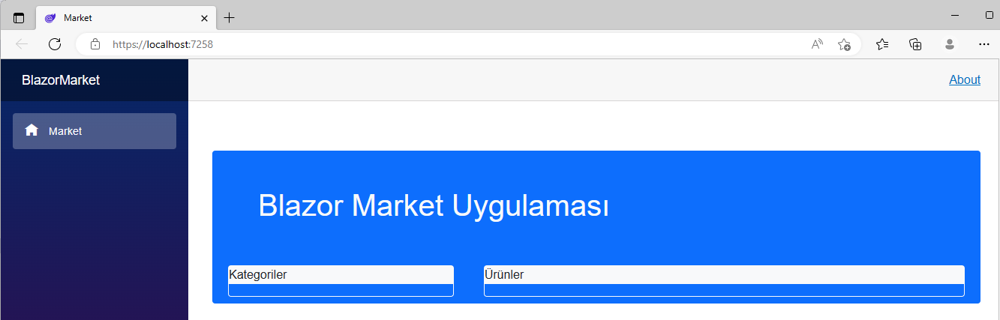

Bu düzen kullanışlı olacak mı, şu an o konuya girmiyorum.
Başlangıç olarak bu taslakla işe başlıyorum:
```
@page "/"

<PageTitle>Market</PageTitle>

<div class="container mt-5 bg-primary rounded border border-primary h-75 d-inline-block">
    <h1 class="m-5 display1 text-light">Blazor Market Uygulaması</h1>

    <div class="row">
        <div class="col-md-4">
            <div class="border border-light m-2 rounded rounded-5">
                <p class="bg-light">Kategoriler</p>
            </div>
        </div>

        <div class="col-md-8">
            <div class="border border-light m-2 rounded rounded-5">
                <p class="bg-light">Ürünler</p>
            </div>
        </div>
    </div>
</div>
```
Bu sayfadaki etiketlerde belirtildiği gibi,
sol sütunda kategoriler listelenecek,
sol sütunda seçilmiş kategoriye ait ürünler de
sağ dütunda listelenecektyir.

## Model Sınıfları

Bir ürünü temsil edecek olan sınıf tanımım
aşağıdaki gibi:
```
    public class Urun
    {
        public int Id { get; set; }
        public string Name { get; set; }
        public string? ImagePath { get; set; }

        public Urun()
        {
            Name = string.Empty;
        }
    }
```
Bir ürün kategorisini temsil edecek olan sınıf tanımı da şöyle:
```
    public class Kategori
    {
        public int Id { get; set; }
        public string Name { get; set; }
        public List<Urun> Urunler { get; set; }

        public Kategori()
        {
            Name = string.Empty;
            Urunler = new List<Urun>();
        }
    }
```

> *Aslında, ileride Entity Framework aracılığıyla sınıf tanımlarını
veri tablolarına dönüştürmeyi düşündüğüme göre,*
kategoriye ait ürünler listesini<br>
`virtual ICollection<Urun>` <br>
*şeklinde tanımlamalıydım.<br>
O zaman bir kategoriyle bağlantılı ürün kayıtları
bağlantılı tablodan toparlanıp ait oldukları
kategori kaydınının altında bir sanal koleksiyon oluştururlardı.
Şimdilik öyle bir derdim yok;
öyle bir derdi olan kendisi düzeltsin eksikleri.*


## Resimlerin Eklenmesi

Bu uygulamada listeleyeceğim hayali ürünler için
temsili resimler aramıştım.
https://icon8.com sitesinde bulup hazır kullandığım
resimlerin linklerini aşağıda sıralıyorum:

+ <a target="_blank" href="https://icons8.com/icon/iNCwBXAbgKmw/baguette">Baguette</a> icon by <a target="_blank" href="https://icons8.com">Icons8</a>
+ <a target="_blank" href="https://icons8.com/icon/kuKTcGYLm4j8/biscuits">Biscuits</a> icon by <a target="_blank" href="https://icons8.com">Icons8</a>
+ <a target="_blank" href="https://icons8.com/icon/16RjD9RQVCUf/bread">Bread</a> icon by <a target="_blank" href="https://icons8.com">Icons8</a>
+ <a target="_blank" href="https://icons8.com/icon/FbwaGJPAh2Yz/brezel">Brezel</a> icon by <a target="_blank" href="https://icons8.com">Icons8</a>
+ <a target="_blank" href="https://icons8.com/icon/erEevcUCwAMR/hamburger">Hamburger</a> icon by <a target="_blank" href="https://icons8.com">Icons8</a>
+ <a target="_blank" href="https://icons8.com/icon/5vw2Fl2rpxRL/hot-dog">Hot Dog</a> icon by <a target="_blank" href="https://icons8.com">Icons8</a>
+ <a target="_blank" href="https://icons8.com/icon/Q2fre4pbJjTx/pizza">Pizza</a> icon by <a target="_blank" href="https://icons8.com">Icons8</a>
+ <a target="_blank" href="https://icons8.com/icon/RNqrG3huUiNN/taco">Taco</a> icon by <a target="_blank" href="https://icons8.com">Icons8</a>
+ <a target="_blank" href="https://icons8.com/icon/nc75M1luTW1N/sandwich">Sandwich</a> icon by <a target="_blank" href="https://icons8.com">Icons8</a>
+ <a target="_blank" href="https://icons8.com/icon/s3EqD09UVwX5/apple">Apple</a> icon by <a target="_blank" href="https://icons8.com">Icons8</a>
+ <a target="_blank" href="https://icons8.com/icon/zWL7WzI3sC0T/apricot">Apricot</a> icon by <a target="_blank" href="https://icons8.com">Icons8</a>
+ <a target="_blank" href="https://icons8.com/icon/LjAILXrCRYc6/banana">Banana</a> icon by <a target="_blank" href="https://icons8.com">Icons8</a>
+ <a target="_blank" href="https://icons8.com/icon/pSpJ8f1TAKIZ/citrus">Citrus</a> icon by <a target="_blank" href="https://icons8.com">Icons8</a>
+ <a target="_blank" href="https://icons8.com/icon/yoflzK7JQMwS/pineapple">Pineapple</a> icon by <a target="_blank" href="https://icons8.com">Icons8</a>

Bu resimler projenin **Images** klasöründedir.
> *Aslında veritabanı bağlantılı projelerde model sınıfları
   **Data** klasöründe olurlar.*

## Kategori ve Ürün Listelerinin Oluşturulması
Bu uygulamada henüz veritabanı bağlantısı yok,
ama sanki varmış da uygulama ilk açılışında
kategori ve ürün listelerini veritabanından
alıp geliyormuş gibi olsun diyoruz.

Dolayısıyla,
```
private void MarketAc()
```
adlı fonksiyonda kategori tanımları oluşturduk
ve onlara bazı ürün tanımları ekledik:
```
Kategori pastaneReyonu = new Kategori("Bulanjeri");

pastaneReyonu.Urunler.Add(new Urun("Ekmek", "icons8-bread-48.png"));
pastaneReyonu.Urunler.Add(new Urun("Baget", "icons8-baguette-48.png"));
pastaneReyonu.Urunler.Add(new Urun("Bisküvi", "icons8-biscuits-48.png"));
pastaneReyonu.Urunler.Add(new Urun("Bredzel", "icons8-brezel-48.png"));
```

Bu fonksiyonu uygulamanın ana sayfası **Index.razor** 
kod dosyasındaki **@code{ }** blokunda bulacaksınız.

Ama bu fonksiyonu uygulamanın ilk açılışında çalıştırmamız
gerekir ki oluşturduğumuz market reyonları ana sayfada listelensinler.

Bir Blazor server uygulamasının açılışında yaptırılacak işleri<br>
`OnInitializedAsync()`<br>
adlı fonksiyonda yaptırmalıyız.

Bu fonksiyon normalde uygulamanın gerektyirdiği standart
başlangıç işlemlerini gerçekleştirir.
Biz kendi uygulamamızda onunla farklı işlemler yaptırmak
istiyorsak, onu **override** etiketiyle yeniden tanımlamalıyız:
```
    protected override async Task OnInitializedAsync()
    {
        await MarketAcmaGorevi();
    }

    private Task MarketAcmaGorevi()
    {
        MarketAc();
        return Task.CompletedTask;
    }
```

Yeniden tanımladığımız başlangıç fonksiyonunda
"görev" (**Task**) gerçekleştirecek ilk fonksiyonları
çağırabiliriz. Bu uygulama örneğinde **MarketAcmaGorevi()**
diye kendi görev fonksiyonumuzu çağırttık.

> *Bu uygulamanın açılış fonksiyonu
   market açan görev fonksiyonu çağırıyor,
   ama iş akışını ona devretmiyor,
   ondan sonuç bekliyor (**await**).<br>
   Web uygulamaları sıradan masaüstü uygulamalardaki
   gibi tek bir iş akışıyla yürümeyen,
   "asenkronize" uygulamalardır.*

Uygulama ilk açıldığında sanal marketin 
tanımlanmış ürünleri sergileniyor olacaktır:

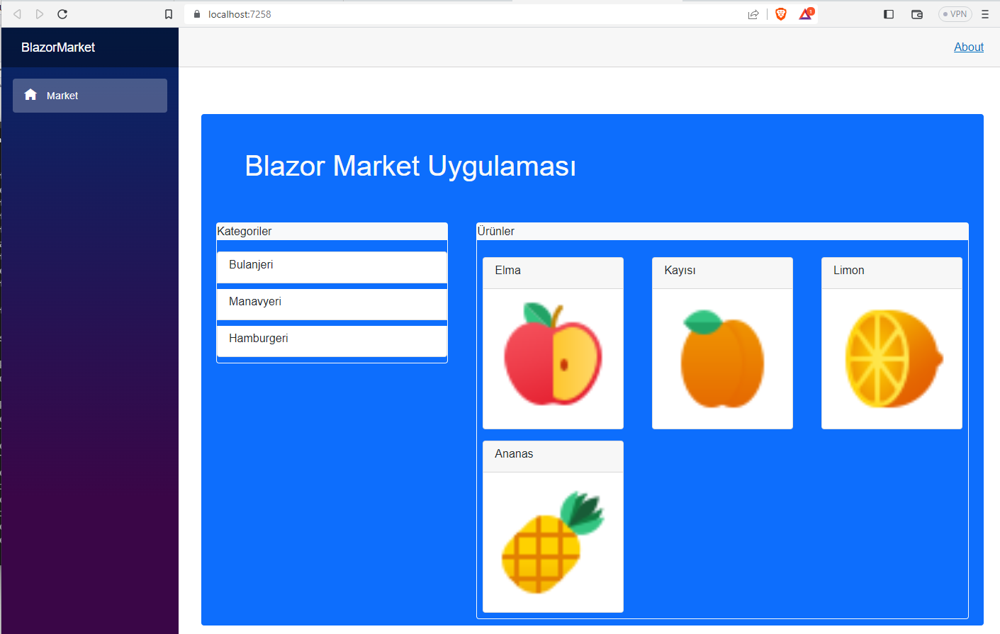

# BlazorTestbank

Bu projeyle çoktan seçmeli sorular içeren 
soru bankalarını listeleyecek,
ekleme/okuma/düzenleme/dilme (*CRUD*)
işlemleri yapabilecek, veritabanı bağlantılı
bir Blazor sunucu uygulaması oluşturuyorum.

Daha önce başladığım 
[**AngularTest**](https://github.com/freebelion/AngularTest)
web uygulamasının Blazor versiyonunu
oluşturmayı hedefliyorum.

Tıpkı **AngularTest** uygulamasındaki gibi,
önce soru bankalarını, soruları ve seçenekleri
temsil edecek sınıf tanımları oluşturacağım.
Daha sonra bu *Entity Framework* (***Code First***)
yaklaşımını izleyerek, bu sınıf tanımlarına
dayalı tablolar içeren veritabanı oluşturacağım.
O aşamalarda 
[bu linkteki](https://www.c-sharpcorner.com/article/blazor-crud-app-using-entity-framework-core-in-net-5/)
gibi örneklerdeki adımları taklit edeceğim.

***Önemli Not***<br>
Aslında veritabanı bağlantılı
masaüstü veya web uygulamaları geliştirirken,
EntityFramework modülleriyle
var olan bir veritabanının tablolarına
dayalı sınıf tanımları oluşturulması
(**Database First**) yaklaşımı daha yaygındır.
Çünkü bu türden uygulamaların olası müşterileri
zaten epeydir veritabanlarında
bilgiler saklıyordur.
   
O yaklaşımı da denemeyi umuyorum.
Bu seferlik, kodlarını sıfırdan yazacağım
bu uygulama için **Code First** yaklaşımını
tercih ettim.
Bu yaklaşımla geliştirilen bir uygulama
uygulama kurulmadan önce hazır olması gereken
bir veritabanının da kurulum paketi
içinde taşınmasını,
ya da kullanıcının bilgisayarında
önceden veritabanı oluşturulmasını gerektirmez.

## Projenin Oluşturulması
Blazor Server App kalıbına dayalı
bir proje oluşturdum.
Tabi bu nedenle proje bazı hazır içeriklerle geldi.
Onları ileriki adımlarda sileceğim.

### "Data" Klasörüne Sınıf Tanımları Eklenmesi
Bu proje kalıbıyla hazır gelen "**Data**" proje
klasörü veritabanı bağlantılarında aracı olacak
sınıf tanımları içindir.
Veritabanı kayıtlarına esas olacak sınıf
tanımlarını da bu klasöre ekliyorum.

+ **`Testbank` Sınıf Tanımı**<br>
  Bir soru bankasını temsil edecek sınıf tanımında
  - soru bankasına verilen adı saklayacak
  **Name** özelliği ile
  - onu tarif edecek bir açıklamayı saklayacak
  **Description** özelliği var:
  ```
    public class Testbank
    {
        [Key]
        [DatabaseGenerated(DatabaseGeneratedOption.Identity)]
        public int Id { get; set; }
        public string Name { get; set; }
        public string Description { get; set; }

        public virtual ICollection<Question> Questions { get; set; }

        public Testbank()
        {
            Guid gid = Guid.NewGuid();
            Name = "Testbank_" + gid.ToString().Substring(0, 8);
            Description = "Description for " + Name;
            Questions = new List<Question>();
        }
    }
    ```
  - `Id` özelliği bu sınıfa dayalı veri tablosu
     kayıtları için ayırt edici sıra numarasını
     saklayacak. Bu sıra nosu veri kaydı eklenirken
     belirlenecek olan "anahtar" (**Key**) bilgidir.
     Biz onu belirleyecek bir işlem yapmıyoruz.
  - `Questions` özelliği de soru bankasındaki
    sorular listesinin referansını taşıyacak.
    Soruları temsil edecek sınıfı da
    aşağıda tanımlıyoruz.

+ **`Question` Sınıf Tanımı**<br>
  
  ```
    public class Question
    {
        [Key]
        [DatabaseGenerated(DatabaseGeneratedOption.Identity)]
        public int Id { get; set; }

        public string HtmlContent { get; set; }

        public virtual ICollection<Choice> Choices { get; set; }

        public Question()
        {
            HtmlContent = "<b>Question_" + Id.ToString() + "</b> Html Content";
            Choices = new List<Choice>();
        }
    }
  ```
  - Bir soruyu temsil edecek olan `Question`
    sınıfında otomatik oluşturulacak
    anahtar bilgi `Id` yanında,
  - sorunun HTML içeriğini saklayacak olan
    `HtmlContent` özelliği,
  - çoktan seçmeli sorular için seçenekler listesine
    referans yapan `Choices` özelliği var.

+ **`Choice` Sınıf Tanımı**<br>
  ```
  public class Choice
    {
        [Key]
        [DatabaseGenerated(DatabaseGeneratedOption.Identity)]
        public int Id { get; set; }

        public string HtmlContent { get; set; }

        public Choice()
        {
            HtmlContent = "<i>Choice</i>";
            HtmlContent = string.Empty;
        }
    }
  ```
  - Çoktan seçmeli bir sorunun  bir seçeneğini
    temsil edecek olan `Choice`
    sınıfında otomatik oluşturulacak
    anahtar bilgi `Id` yanında,
  - seçeneğin HTML içeriğini saklayacak olan
    `HtmlContent` özelliği var.

Bu sınıf tanımları *Entity Framework* tarafından
veri tablolarını oluşturmak için kullanılacaktır.
Örneğin, `Testbank` sınıf tanımına dayalı
olarak bir `Testbanks` tablosu oluşturulacak,
sınıf özelliklerinin her biri de
o veri tablosunun bir sütunu (*data field*)
olarak gözükecektir.

### EntityFramework Modüllerinin Eklenmesi
Visual Studio geliştirme ortamının
**Tools** menüsünü açarsanız, o menüde
"Nuget Package Manager" seçeneğini göreceksiniz.
> Türkçesini bilmiyoruz, ama herhalde
  "Nuget paket Yöneticisi" gibi bir şeydir.

O seçeneğin alt menüsündeki ikinci seçeneği,
yani "Manage Nuget packages for Solution"
seçenğini tıklarsanız, NuGet ile proje grubuna
hazır modüller ekleyebilirsiniz.

Bizim eklediğimiz modülleri
aşağıdaki resimde gösterdik:
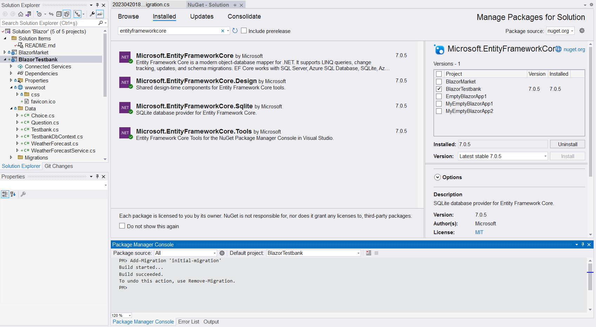

Özetle,
+ Projeyi .NET Core ile geliştirdiğimiz için
  **Microsoft.EntityFrameworkCore** modülünü seçtik.
+ Bu modülün sağladığı hazır tanımları kullanabilmek için de
  **Microsoft.EntityFrameworkCore.Design**
  ve **Microsoft.EntityFrameworkCore.Tools**
  modüllerini ekledik.<br>
  Bu iki modülün kesin gerekli olup olmadığından
  çok da emin değiliz. Biz örnekleri taklit ediyorduk.
  Eğer siz onları eklemeden de projenizi
  çalıştırmışsanız, onlara gerek yokmuş demektir.
+ SQLServer gibi kapsamlı bir kurulum gerektirmeyen
  "yerel" bir veritabanı kullanalım diye,
  **Microsoft.EntityFrameworkCore.SqLite**
  modülünü ekledik.

### Veritabanı Dönüşümü
Yukarıdaki ekran resminde *EntityFramework* ile
veritabanının oluşturulması adımını da gösterdik:

"Nuget Package Manager" seçeneğinin alt menüsündeki
ilk seçeneği (*Package Manager Console*) tıklayıp,
NuGet modüllerini komutlarla ayarlamamıza
izin veren konsol penceresini açtık.

Sınıf tanımlarına dayalı olarak veritabanını
oluşturmak için<br>
`Add Migration 'Initial Migration'`<br>
komutunu çalıştırdık.

***DİKKAT!***<br>
`Add Migration` komutu sınıf tanımlarından
veritabanına bir "göç" işlemi başlatarak
veritabanını oluşturur.
Bu komutu izleyen tırnaklar içindeki ifade
bu "göç" adımına bizim verdiğimiz addır.
Bu ad "Kalktı göç eyledi tabansız veriler."
de olabilirdi.
Önemli olan şey, her göç adımına ayrı bir ad vermektir.
Biz bu projeyi geliştirirken sınıf tanımlarında 
başka değişiklikler yapsaydık,
tablo yapıları da onlarla uyumlu olacak
şekilde değişsin diye yi `Add Migration` komutunu
başka bir ad vererek yenileyecektik.

### Veritabanı Aracı Nesnesinin Oluşturulması
Veritabanı bir kod nesnesi değildir;
uygulamanın veritabanıyla iletişim kurması
için özel bir sınıf tanımlamamız gerekecektir.

Bu işi yapacak olan hazır bir sınıf tanımı
`DbContext` yukarıda eklediğimiz modüllerden
biriyle gelir (ama hangisi, bilmiyoruz).

O sınıf türü bir nesne oluştururken
ve o nesneyi kullanırken yapmamız gereken
ek ayarlar olacağı için, biz o sınıftan
kendi projemiz için ayrı bir sınıf
türetmeyi seçtik:

```
    public class TestbankDbContext : DbContext
    {
        public TestbankDbContext() : base()
        {
            Database.EnsureCreated();
        }

        public TestbankDbContext(DbContextOptions<TestbankDbContext> options) : base(options)
        {
            Database.EnsureCreated();
        }

        public DbSet<Testbank> Testbanks { get; set; }
        public DbSet<Question> Questions { get; set; }
        public DbSet<Choice> Choices { get; set; }

        protected override void OnConfiguring(DbContextOptionsBuilder optionsBuilder)
        {

            optionsBuilder.UseSqlite(@"DataSource=testbanks.db;");
        }
    }
```

Sınıf tanımındaki ilk iki fonksiyon
bu türden bir nesne oluşturulduğunda
gerekli ilk işlemleri gerçekleştirecek olan
"kurulum fonksiyon"larıdır.
Bunların tanım başlıkları aynı burada gösterdiğimiz
gibi olmalıdır. Sorgulamadan taklit edin, yeter,
biz de öyle yaptık.
Ama uygulamanızı önceden veritabanı yokken
denerseniz sorun çıkmasın diye
(*bizim denememizde sorun çıktı*)
veritabanının oluşturulduğundan emin olacak
komutları bu kurucu fonksiyonlara eklemeyi unutmayın.

Türettiğimiz bu sınıf 
atası olan `DbContext` sınıfına ait
`OnConfiguring()` metodunu 
`override` etketiyle yeniden tanımlıyor.
O fonksiyon uygulamamızın veritabanını
oluştururken kullanacağı SQLite
yerel veritabanının adını iletiyor.

Bu türetilmiş sınıf tanımın özellikleri de
sınıf tanımlarına dayalı veri tablolarına
referans yapmak içindir.

Uygulama aktifken bu türden bir nesne aracılığıyla
veritabanıyla iletişim kuracaktır.
Bu aracı nesnenin tanımını uygulamayı başlatan
işlemlerin yapıldığı Program.cs kod dosyasında
oluşturuyoruz:<br>
`builder.Services.AddDbContext<TestbankDbContext>();`<br>
Uygulama başlatılırken bu komut çalıştırılınca
`TestbankDbContext` sınıfı kendi konfigürasyonunu
oluşturacak, yani veritabanını açacak ve onunla
iletişim halinde kalacaktır.

### Veritabanı Bağlantı Hizmetinin Oluşturulması
Veritabanı aracı nesnesinin tablolara kayıt ekleyecek,
tablolardan kayıt bulup getirecek, 
tablolardaki kayıtları düzenleyecek
veya silecek olan üye fonksiyonları (metodları) vardır.
Web uygulamamızda gerekli yerlerde veritabanı
üzerinde işlem yaptırmak için o metodları kullanabiliriz,
ama metodları kullanım tarzımız değişirse,
ya da daha da kötüsü, SQLite yerine başka türden
veritabanı kullanmaya karar verirsek,
tüm o metod çağrılarını değiştirmemiz gerekebilir.

Bunu göz öüne alarak, veritabanı aracı nesnesini kullanacak
bir hizmet oluşturmak daha iyidir diye karar verdik.
Zaten baktığımız örneklerde de hep öyle yapılıyordu;
bir hikmeti vardı, herhalde.

Yine baktığımız örnekleri taklit ederek,
şu veritabanı iletişim hizmetini oluşturduk:

```
    public class TestbankDbService
    {
        private readonly TestbankDbContext tbdbContext;

        public TestbankDbService(TestbankDbContext tbContext)
        {
            tbdbContext = tbContext;
        }

        // Get a list of Testbanks
        public async Task<List<Testbank>> GetAllTestbanksAsync()
        {
            return await tbdbContext.Testbanks.ToListAsync();
        }
    }
```

Bu hizmet sınıfı aslında uygulamamız başlarken oluşturulan
`TestbankDbContext` türü veritabanı aracı nesnesi için
bir kılıf olarak iş görüyor.
Kurucu fonksiyonunda o aracı nesnenin bir referansını
alıp saklıyor. O referans aracılığıyla da veritabanı
üzerinde işlemler yaptıracaktır.

Örnek olarak **Testbanks** tablosundaki kayıtları alıp
listeleyecek olan bir metod ekledik.
Bu türden veritabanı işlemleri uzun sürebileceği için
asenkronize (eş zamanlı olmayan) bir çağrı kullandık.
Böylece web uygulamamız kendi işini görürken
soru bankalarının listelenmesi işini bu fonksiyona
havale edecek, ondan bir sonuç gelince 
oluşturulmuş listeyi görüntüleyecek.

Uygulama açılırken bu hizmetin de açılması için
yine Program.cs kod dosyasında bir ekleme yapmamız
gerekecektir:<br>
`builder.Services.AddScoped<TestbankDbService>();`

### Uygulama Ana Sayfasının Oluşturulması
Projemizin **Index.razor** kod dosyasındaki
düzenlemelerimizle web uygulamamızın
ana sayfasını oluşturacağız.

Orijinal projedeki örnek içeriği silip,
onun yerine aşağıdaki kodları ekledik:

```
@using BlazorTestbank.Data
@inject TestbankDbService tbdbService

@page "/"

<PageTitle>Testbanks</PageTitle>

<div class="container mt-5 bg-primary rounded border border-dark">
    <h1 class="m-2 display1 text-light text-center">
        Blazor Testbank App
    </h1>

    <div class="row">
        <div class="col-md-4 p-2">
            <!-- Soru bankaları Listesi burada gözükecek.-->
        </div>
    </div>
</div>

@code {
    List<Testbank>? TbList;
    protected override async Task OnInitializedAsync()
    {
        TbList = await Task.Run(() => tbdbService.GetAllTestbanksAsync());
    }
}
```

Bu ana sayfa veritabanıyla iletişim için bir **@inject**
çağrısıyla yukarıda tanıttığımız hizmeti başlatıyor.
Sayfanın **@code** blokuna bakarsanız,
sayfa açılırken işleme konacak olan
**OnInitializedAsync()** fonksiyonunda bu hizmetten
soru bankaları listesinin alındığı göreceksiniz.
> *Bu uygulama .NET Core tabanına dayalı olduğu için,
   listenin oluşturulmadığı bir duruma hazırlık olarak
   **TbList** için null (boş) adres alabilir bir
   referans değişkeni tanımı yaptık.*

Yani bu web uygulaması açılırken,
ilk işi veritabanında var olan soru bankaları
listesini alıp getirmektir.

O liste ana sayfadaki "container" türü çerçeve bölümünün
sol bölümünde görüntülenecektir.
Ama liste görüntüleme işini bu ana sayfada değil,
ayrı bir Blazor öğesinde yaptırmayı planlıyoruz.

### Soru Bankası Listeleyen Öğenin Oluşturulması
Düz kod yazarken işleri ayrı fonksiyonlarda
yaptırdığımız gibi, we uygulamalarında da
ayrı işleri ayrı öğelere (*components*)
yaptırmayı tercih etmeliyiz.
Biz de soru bankalarını listeleme işini
ana sayfadan ayrı bir Razor öğesinde yaptıracağız.

Uygulamanın sayfa tanımlarının bulunduğu
**Pages** proje klasörü üzerinde
"Add" > "Razor Component" menü seçeneklerini
tıklayarak, **TestbankListComponent.razor**
adlı şu öğeyi oluşturduk:

```
@using BlazorTestbank.Data

@if (tbanks != null)
{
    <div class="border border-light m-2 rounded rounded-5">
        <h2 class="display2 text-light text-center">Testbanks</h2>
        <ul class="list-group">
            @foreach (var tb in tbanks)
            {
                <li class="list-group-item mt-1">
                    <h6>
                        @tb.Name<br>
                        <small class="text-muted">
                            @tb.Description
                        </small>
                    </h6>
                </li>
            }
        </ul>
    </div>
}

@code {
    [Parameter]
    public List<Testbank>? tbanks { get; set; }
}
```

Bu öğe ayrı bir sayfayı temsil etmediği için
**Index.razor** kod dosyasındaki gibi bir **@page**
referansı yok. Daha önceki örneklerde tanıttığımız
*Razor Component* örnekleri gibi,
aslında bir alt sayfa öğesi.

Bu öğe (**@code** blokuna bakınız) parametre olarak
görüntüleyeceği listenin referansını alıyor.
Belki bir parametre gelmez diye yine null (boş) 
adres alabilecek bir referans değişkeni tanımladık.

Sayfanın HTML içeriğine bakarsanız,
parametreyle gelen referans geçerliyse,
o listenin her bir elemanını
maddeli bir liste gibi görüntülüyor.

Artık ana sayfa Index.razor içeriğinde
boş bıraktığımız yere bu öğenin referansını
ekleyebiliriz:

```
    <div class="row">
        <div class="col-md-4 p-2">
            <TestbanksListComponent tbanks="@TbList"/>
        </div>
    </div>
```

Uygulamayı çalıştırdığımızda (varsa) veritabanındaki
soru bankası kayıtları aşağıdaki gibi listelenmiş olacaktır:

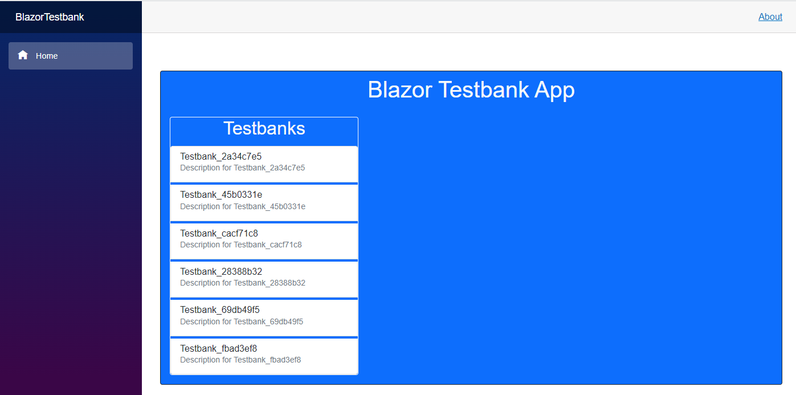