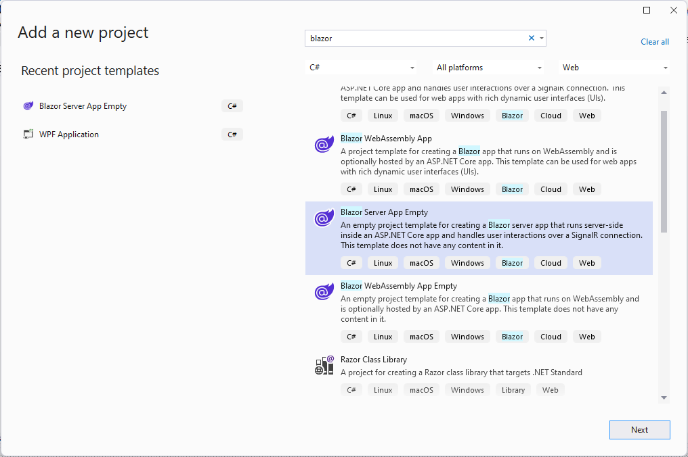

Bu projeler grubu altında "Blazor Server App" şablonuyla
bazı deneme uygulamaları oluşturuyorum.
Bu belgeyi de *güya* benim gibi yeni öğrenenlere
yardım etmek için oluşturdum.
> *Asıl niyetim kendi keşif yolculuğum için bir günlük tutmak.*

Buradaki amacım daha alışık olduğum .NET platformu üzerinde,
iyi bildiğim C# programlama diliyle tek sayfalık web uygulamaları
(*single page web applications*) oluşturmak.

Bu gruptaki hemen hemen her projeyi **"Blazor Server App Empty"**
(Blazor Server Boş Uygulama) kalıbıyla oluşturacağım:

Dikkat etmişsinizdir, "blazor" terimiyle yaptığım arama sonucunda
"Boş" (*Empty*) olmayan Blazor uygulaması kalıpları da var.
Bunlar belli bir iskelet üzerinde geçici içerikler sunacaklardır.
yeni başlayan birisi için öylesi daha faydalı olacak sanabilirsiniz,
ama iş kendi içeriğinizi kendi düzeninizle sunmaya gelince,
o kurulum iskeleti ve geçici içerikleri silmekle uğraşmanız gerekebilir.
Öylesi benim işime gelmediği için, boş kalıpla başlamayı tercih ettim.

# EmptyBlazorApp1

Boş Blazor uygulaması kalıbını oluşturduğum ilk denemem.
Bu uygulamanın herhangi bir işlevi yok.

# MyEmptyBlazorApp1

İlk denemeyle oluşturduğum boş uygulama kalıbına dayalı
olan bu uygulamada hayali hisse senetlerini  listeletiyorum.

# MyEmptyBlazorApp2

İlk denemede oluşturduğum boş uygulama kalıbına
dayalı olan bu uygulama nesne listeleme
veya seçilen nesneyi görüntüleme işlerini
ayrı Razor öğelerine (*Razor Components*)
havale ediyor.

# BlazorMarket

Bu uygulamada ürün kategorileri olacak ve
kategorilere ait ürünler olacak.
Bunları bir veritabanından almayacağım,
onu yerine, kodlarla kendi tanımladığım
nesnelerde oluşan listeleri görüntüleyeceğim.

# BlazorTestbank

Bu projeyle çoktan seçmeli sorular içeren 
soru bankalarını listeleyecek,
ekleme/okuma/düzenleme/dilme (*CRUD*)
işlemleri yapabilecek, veritabanı bağlantılı
bir Blazor sunucu uygulaması oluşturuyorum.