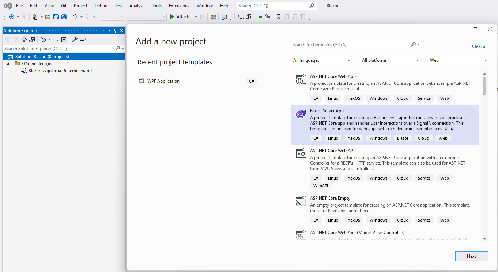

Bu projeler grubu altında "Blazor Server App" şablonuyla
bazı deneme uygulamaları oluşturuyorum.
Bu belgeyi de
*güya, benim gibi yeni öğrenenlere yardım etmek için*
oluşturdum. Tabi asıl niyetim kendi keşif yolculuğum
için bir günlük tutmaktı.

# BlazorTest
Bu ilk denemede, daha önce oluşturup Github profilimde
paylaştığım **AngularTest** gibi bir random test uygulaması
oluşturuyorum. Bu uygulama kullanıcısına soru bankaları
oluşturmak, soru bankalarına sorular, sorulara da seçenekler
veya başka tür cevap giriş imkanları ekleme imkânı sunacaktır.

## Projeyi Oluşturmak
Bu projenin ilk adımı olarak, bütün platformlarda
Web uygulamaları geliştirmek için kullanılan şablonlar
arasından "Blazor server App" şablonunu seçtim:

> *Şimdiden yazayım, bu gruptaki tüm projeler için ilk adımım bu olacaktır.*

Bir sonraki adım bu şablonun hazır sunduğu örnek öğeleri

- Data/WeatherForecast.cs
- Data/WeatherForecastService.cs
- Pages/Counter.razor
- Pages/FetchData.razor

ve onlarla referans yapan program satırlarını silmek oldu.
> *Bunu ilk araştırmalarımda bulduğum
[şu sayfadan](https://www.ezzylearning.net/tutorial/implementing-crud-operations-in-blazor-server-apps)
öğrenmiştim.*

## Model Sınıflarını Oluşturmak
Bu projede *Entity Framework* kullanacaktım,
ama kodlarla başlamak yolunu (*code first* yaklaşımı)
seçmiştim. Bu nedenle, daha önceki web uygulaması
denemelerim için araştırma yaparken gördüğüm
[bu sayfadaki](https://learn.microsoft.com/en-us/aspnet/core/tutorials/razor-pages/model?view=aspnetcore-7.0&tabs=visual-studio)
adımları taklit ettim.

Projenin ilk halindeki **Data** klasörünü silip,
onun yerine **Models** adlı bir klasör ekledim.
Bu proje klasörü altında soru bankalarını, soruları,
seçenekleri, vb. temsil eden model sınıflarını oluşturacaktım.